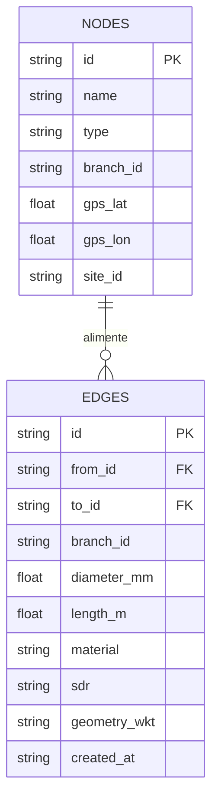
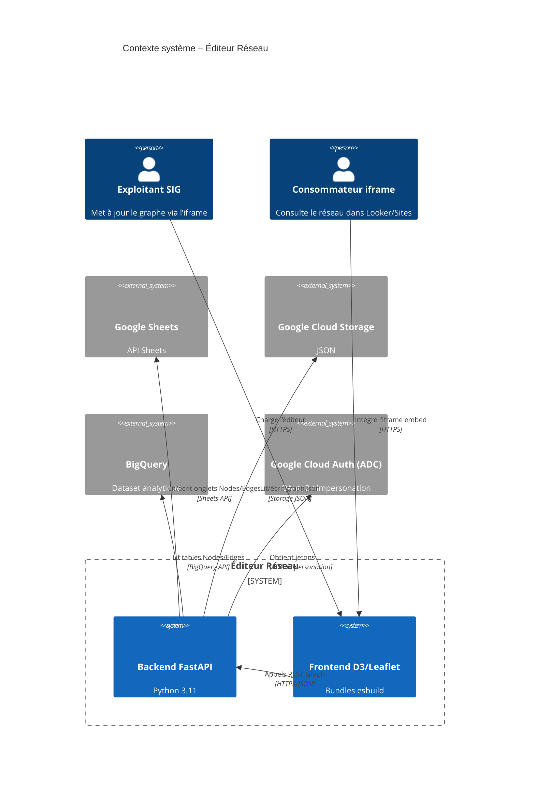
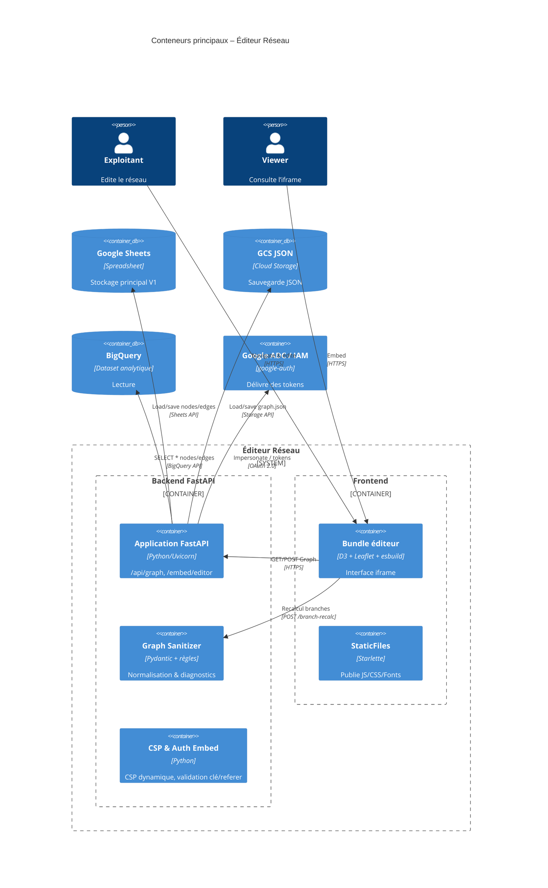
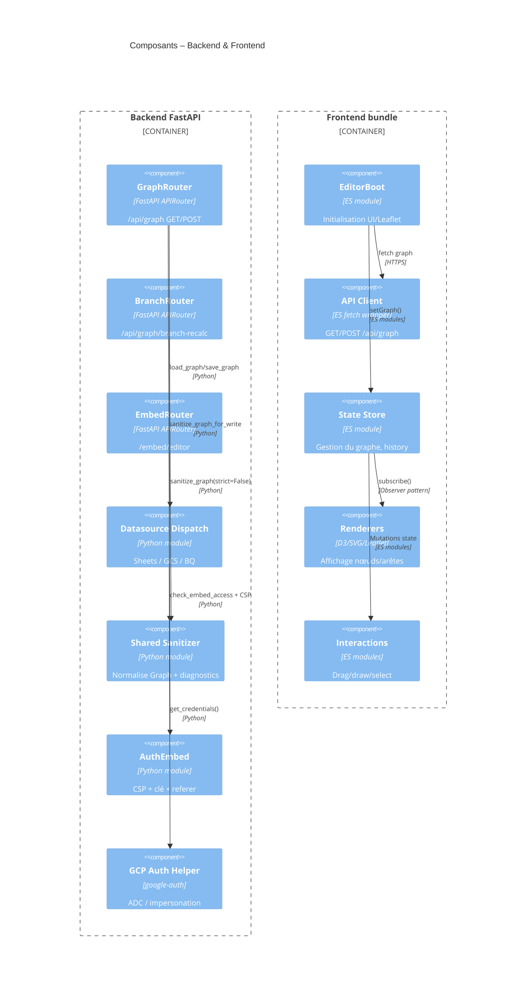
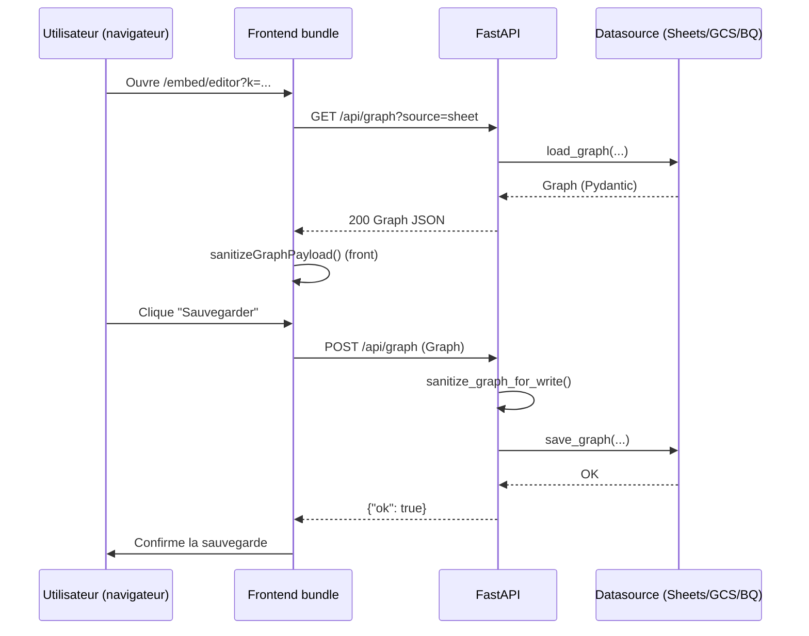
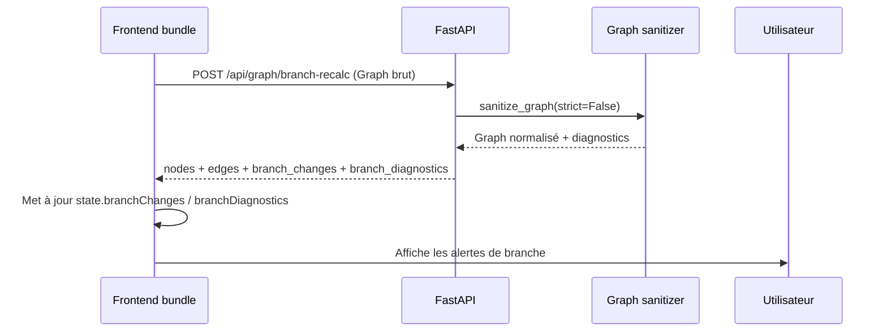

docs/
├── README.md
├── overview/
│   ├── architecture.md
│   └── processes.md
├── tutorials/
│   ├── getting-started.md
│   └── build-first-feature.md
├── how-to/
│   ├── run-locally.md
│   ├── diagnose-failures.md
│   ├── add-endpoint.md
│   ├── add-ui-component.md
│   ├── rotate-secrets.md
│   └── upgrade-deps.md
├── reference/
│   ├── api/
│   │   └── openapi.yaml
│   ├── events/
│   │   └── README.md
│   ├── schemas/
│   │   ├── graph.schema.json
│   │   ├── branch-recalc-request.schema.json
│   │   └── branch-recalc-response.schema.json
│   ├── db.md
│   ├── config.md
│   ├── cli.md
│   └── error-catalog.md
├── explanations/
│   ├── architecture-decisions.md
│   ├── security-model.md
│   ├── performance-scalability.md
│   └── limitations-future-work.md
├── diagrams/
│   ├── c4-context.md
│   ├── c4-container.md
│   ├── c4-component.md
│   ├── key-sequences.md
│   └── processes-bpmn.md
├── data-contracts/
│   └── data-catalog.md
├── observability/
│   └── logging-audit-map.md
├── TRACEABILITY.md
└── DRIFT.md

\=== BEGIN FILE: docs/README.md
# Éditeur Réseau – Portail de documentation

Bienvenue dans la base de connaissances de l’Éditeur Réseau. Ce projet remplace le backend Apps Script historique par une API FastAPI et un frontend D3/Leaflet empaqueté localement, embarquable dans Looker Studio ou Google Sites.

## Résumé produit
- **[Backend Python]** expose l’API `/api/graph` (lecture/écriture), le recalcul de branches et la page `/embed/editor`, avec CSP stricte et middleware dédié (`app/main.py:13-39`, `app/routers/api.py:12-68`, `app/routers/branch.py:11-22`, `app/routers/embed.py:14-46`).
- **[Frontend JS/TS]** fournit un éditeur autonome (bundles `app/static/bundle/*`) orchestré par `web/src/editor.boot.ts` et son magasin d’état (`web/src/state/index.js`).
- **Sources de données** interchangeables via `app/datasources/` : Google Sheets (par défaut), fichier JSON local/GCS, BigQuery (lecture seule).
- **Sécurité** : clé d’embed statique, contrôle du Referer (`app/auth_embed.py:8-49`), ADC/impersonation Google (`app/gcp_auth.py:8-44`), CSP calculée dynamiquement.

## Publics cibles
- **Exploitants métier** : manipulent le graphe via l’iframe, peuvent exporter/importe JSON.
- **Développeurs & DevOps** : maintiennent l’API, le build frontend et l’intégration Google Cloud/CI.

## Architecture en un coup d’œil
> Note : les diagrammes complets (C4 niveaux 1-3 et séquences clés) sont détaillés dans `docs/overview/architecture.md` et `docs/diagrams/`.

- Flux principal : navigateur → `/embed/editor` → bundles statiques → `/api/graph`.
- Les écritures se propagent vers Google Sheets ou GCS via `app/datasources/__init__.py:21-77`.
- Les identités machine proviennent d’ADC (`gcloud auth application-default login`) ou d’une impersonation de service account (`app/config.py:38-75`, `app/gcp_auth.py:8-44`).

## Parcours de lecture recommandé
1. **Vue d’ensemble** : `docs/overview/architecture.md` pour comprendre les couches et dépendances.
2. **Tutoriels** : commencer par `docs/tutorials/getting-started.md`, puis `docs/tutorials/build-first-feature.md`.
3. **Guides opérationnels** : dossier `docs/how-to/` (exécution locale, rotation de secrets, ajout d’endpoints).
4. **Références** : OpenAPI, schémas JSON, base de données et catalogue d’erreurs dans `docs/reference/`.
5. **Explications** : décisions structurantes, modèle de sécurité, performance et limites dans `docs/explanations/`.

## Liens rapides
- Vue architecture : [overview/architecture.md](overview/architecture.md)
- Démarrage rapide : [tutorials/getting-started.md](tutorials/getting-started.md)
- Spécification API : [reference/api/openapi.yaml](reference/api/openapi.yaml)
- Schémas JSON : [reference/schemas/](reference/schemas/)
- Catalogue des flux : [data-contracts/data-catalog.md](../data-contracts/data-catalog.md)
- Observabilité & audit : [observability/logging-audit-map.md](../observability/logging-audit-map.md)
- Traçabilité doc/code/tests : [TRACEABILITY.md](../TRACEABILITY.md)

> Attention : ne jamais commiter de secrets (`.env`, clés d’embed, tokens ADC). Utiliser Google Secret Manager sur Cloud Run et vérifier les rôles IAM (`README.md`, `NOTICE_IMPLEMENTATION.md`).

## Support & suivi
- Feuille de route : `docs/roadmap/roadmap-v1.md`.
- Plan de tests manuel : `TEST_PLAN.md`.
- ⚠️ TODO: Documenter le canal de support (Slack/Email) et le responsable produit pour la phase V2.
\=== END FILE

\=== BEGIN FILE: docs/overview/architecture.md
# Architecture applicative

## Panorama du système
L’Éditeur Réseau est une application Cloud Run composée d’un backend FastAPI (`app/main.py`) et d’un frontend D3/Leaflet bundlé via esbuild (`build.mjs`). Un navigateur charge `/embed/editor`, ce qui sert les bundles statiques puis dialogue avec `/api/graph` pour récupérer ou sauvegarder la structure du réseau (nœuds, arêtes, branches). Les données peuvent provenir de Google Sheets, de JSON stocké sur Google Cloud Storage (ou fichier local en dev) et de BigQuery (lecture seule).

## Diagrammes C4 disponibles
- **Contexte (L1)** : acteurs externes et dépendances (Google Sheets, GCS, BigQuery, ADC). Voir `../diagrams/c4-context.md`.
- **Conteneurs (L2)** : séparation backend/ frontend, adaptateurs de données, stockage. Voir `../diagrams/c4-container.md`.
- **Composants (L3)** : routers FastAPI, sanitizeurs, modules frontend (state, renderers, interactions). Voir `../diagrams/c4-component.md`.
- **Séquences clés** : chargement et sauvegarde d’un graphe, recalcul de branches. Voir `../diagrams/key-sequences.md`.

## Couches techniques

### [Frontend JS/TS]
- `web/src/editor.boot.ts:1-220` orchestration UI : initialise D3/Leaflet, l’historique (`createHistory`), les interactions (drag/draw) et appelle `web/src/api.js:1-86`.
- `web/src/state/` : magasin d’état centralisé, normalisation des graphes (`normalizeGraph`), règles de branche (`graph-rules.js`).
- `web/src/shared/graph-transform.ts:1-220` : nettoyage côté client (coercition numérique, gestion des branches, géométrie).
- Les bundles sont générés via `build.mjs:1-88` (JS + CSS + assets fonts/icônes). Aucun CDN n’est utilisé (`package.json`, `web/styles/*`).

### [Backend Python]
- Application FastAPI (`app/main.py:13-39`) avec middleware CSP personnalisé (`CSPMiddleware`).
- Routers :
  - `/api/graph` (`app/routers/api.py:12-68`) : lecture/écriture du modèle `Graph`.
  - `/api/graph/branch-recalc` (`app/routers/branch.py:11-22`) : recalcul des branches via `sanitize_graph`.
  - `/embed/editor` (`app/routers/embed.py:14-46`) : page HTML Jinja (templates `app/templates/index.html`).
- Sanitisation et normalisation côté serveur : `app/services/graph_sanitizer.py:12-165`, `app/shared/graph_transform.py:942-1318`.
- Support Google Cloud : `app/gcp_auth.py:8-44` (ADC/impersonation), `app/auth_embed.py:8-49` (CSP, clé, Referer).

### [API]
- Endpoints documentés dans `docs/reference/api/openapi.yaml`.
- Modèle `Graph` défini dans `app/models.py:37-151` (nœuds/arêtes/branches, calcul de longueurs).
- Tests de contrat : `tests/test_api_contract.py:12-110`, `tests/test_graph_sanitizer.py:20-168`.

### [DB]
- Google Sheets : adaptateur `app/datasources/sheets.py:17-63`, onglets `Nodes` et `Edges`.
- Google Cloud Storage JSON : `app/datasources/gcs_json.py:17-117`, merge des positions (x/y) lors des sauvegardes.
- BigQuery lecture : `app/datasources/bigquery.py:17-149` (mapping colonnes FR/EN, parsing WKT). Écriture non implémentée (`save_bigquery` → 501).

### [Messaging/Events]
- Aucun bus d’événements interne. La documentation `docs/reference/events/README.md` recense ce manque. ⚠️ TODO: définir des événements si un bus Pub/Sub est introduit (V2 RBAC).

### [Infra/CI]
- Build frontend : `npm run build` (esbuild).
- Tests backend : `python -m unittest` (`tests/`).
- Déploiement Cloud Run : commande type dans `README.md` et `NOTICE_IMPLEMENTATION.md`, utilisant `gcloud run deploy ...`.
- Auth Google : ADC + impersonation (`docs/overview/architecture.md` ↔ `app/config.py:38-75`).

### [Services externes]
- Google Sheets API, Drive API.
- Google Cloud Storage JSON (scopes read/write).
- BigQuery API (lecture).
- Map tiles optionnels (`settings.map_tiles_url`, `app/config.py:71-74`), CSP mis à jour dynamiquement.

## Sécurité & gouvernance
- Clé d’embed (`EMBED_STATIC_KEY`) + contrôle du Referer (`ALLOWED_REFERER_HOSTS`) (`app/auth_embed.py:39-49`).
- CSP stricte + suppression d’`X-Frame-Options` pour autoriser l’iframe (`app/main.py:13-33`).
- ADC/impersonation unique recommandée (éviter double impersonation), voir `docs/how-to/rotate-secrets.md`.
- Données sensibles : coordonnées GPS, diamètres, commentaires d’exploitation (PII potentielle). Voir `docs/data-contracts/data-catalog.md`.

## Flux principaux
1. **Chargement de graphe** : frontend `fetch('/api/graph')` → adaptateur (Sheets/GCS/BQ) → modèle `Graph`.
2. **Sauvegarde** : frontend `POST /api/graph` → `sanitize_graph_for_write` → `save_*`.
3. **Recalcul branche** : `POST /api/graph/branch-recalc` (strict=False) → diagnostics, renvoyés au client.
4. **Embed** : `GET /embed/editor?k=...` → contrôle clé + Referer + CSP → template `index.html`.

⚠️ TODO: ajouter un mécanisme de signature courte durée pour les liens d’embed (roadmap V2, `docs/handbook/agents.md`).
\=== END FILE

\=== BEGIN FILE: docs/overview/processes.md
# Processus métier

Cette section décrit les parcours métier cibles et leurs points de contrôle. Les diagrammes Mermaid utilisent une notation « BPMN allégée » : les nœuds ronds représentent des événements, les rectangles des tâches, les losanges des décisions. Les couleurs sont symbolisées via des libellés.

## Processus 1 — Mettre à jour un réseau via l’éditeur
1. L’exploitant ouvre le lien iframe (`/embed/editor?k=...`).
2. Le frontend charge le graphe (`GET /api/graph`).
3. L’opérateur modifie nœuds/arêtes, déclenche éventuellement un recalcul (`POST /api/graph/branch-recalc`).
4. Il sauvegarde (`POST /api/graph`), ce qui met à jour la source active (Sheets/GCS).
5. Un export JSON optionnel est généré côté frontend.

```mermaid
flowchart LR
    A((Début)) --> B[Ouvrir l'iframe /embed/editor]
    B --> C{Clé & Referer valides ?}
    C -- Non --> X[Refus HTTP 403]
    C -- Oui --> D[GET /api/graph]
    D --> E[Affichage du réseau]
    E --> F{Modification du graphe ?}
    F -- Non --> H[Fin (consultation)]
    F -- Oui --> G[POST /api/graph/branch-recalc (optionnel)]
    G --> I[POST /api/graph]
    I --> J{Écriture réussie ?}
    J -- Non --> K[Diagnostique / tests]
    J -- Oui --> L[Export JSON (facultatif)]
    L --> M((Fin sauvegarde))
```

## Processus 2 — Publier et auditer un graphe partagé
1. Un data steward prépare un environnement (ADC/impersonation, clé d’embed).
2. Il configure les variables (`.env`, Google Sheets partagé).
3. Il lance l’API FastAPI (`uvicorn ... --env-file .env.dev`).
4. Il met en place un référentiel d’audit (logs, sauvegarde GCS).
5. Les utilisateurs métier consomment l’iframe ; la supervision vérifie les journaux (`docs/observability/logging-audit-map.md`).

```mermaid
flowchart LR
    S((Start)) --> P1[Configurer ADC / IAM]
    P1 --> P2[Définir .env (SHEET_ID_DEFAULT, EMBED_STATIC_KEY)]
    P2 --> P3[Lancer uvicorn avec .env]
    P3 --> P4[Configurer sauvegarde GCS JSON / BigQuery lecture]
    P4 --> P5[Publier iframe dans Looker Studio / Sites]
    P5 --> P6{Logs complets ?}
    P6 -- Non --> P7[Adapter logging/audit map]
    P6 -- Oui --> P8((Fin publication))
```

> Note : un diagramme Mermaid dédié est disponible dans `../diagrams/processes-bpmn.md`.

⚠️ TODO: documenter un processus d’escalade incident (astreinte) lorsque l’API retourne des 5xx répétés.
\=== END FILE

\=== BEGIN FILE: docs/tutorials/getting-started.md
# Tutoriel – Prendre en main l’Éditeur Réseau

Objectif : passer d’un dépôt cloné à un éditeur fonctionnel en local, prêt à intégrer un Google Sheet. Ce tutoriel suppose que vous n’avez jamais lancé le projet.

## 1. Prérequis
- Python 3.11 ou 3.12 (`python --version`).
- Node.js ≥ 18 (recommandé : 20+) (`node -v`).
- Google Cloud SDK (`gcloud --version`) configuré sur le projet cible.
- Accès au Google Sheet du réseau (onglets `Nodes` et `Edges`).

> Attention : utilisez un environnement virtuel Python pour isoler les dépendances (`requirements.txt`).

## 2. Cloner le dépôt et créer l’environnement Python
```bash
git clone <URL_DU_DEPOT> GraphReseau
cd GraphReseau
python -m venv .venv
source .venv/bin/activate  # Windows PowerShell: .venv\Scripts\Activate.ps1
pip install -U pip
pip install -r requirements.txt
```
Références : `requirements.txt`, `README.md`.

## 3. Installer les dépendances frontend et construire les bundles
```bash
npm install
npm run build       # build production (esbuild, `build.mjs:1-88`)
```
> Note : `npm run build:dev` ajoute des sourcemaps et active les logs dev (`BUILD_DEV=1`).

## 4. Configurer l’environnement
1. Dupliquer `.env.example` en `.env.dev`.
2. Renseigner :
   - `SHEET_ID_DEFAULT`
   - `EMBED_STATIC_KEY`
   - `ALLOWED_REFERER_HOSTS` (ex: `localhost 127.0.0.1`)
   - `ALLOWED_FRAME_ANCESTORS` (ex: `http://localhost:8000`)
3. Optionnel : `DATA_SOURCE`, `GCS_JSON_URI`, `BQ_*`.

> Attention : ne commitez jamais `.env.dev`. Ajoutez-le à `.gitignore` si nécessaire.

## 5. Authentification Google Cloud (ADC)
- Solution rapide : `gcloud auth application-default login`.
- Recommandé : impersonation d’un compte de service (`docs/how-to/rotate-secrets.md`, `app/gcp_auth.py:8-44`).
- Vérifiez avec `gcloud auth application-default print-access-token`.

## 6. Lancer l’API FastAPI
```bash
uvicorn app.main:app --reload --port 8080 --env-file .env.dev
```
- Vérifiez `http://127.0.0.1:8080/healthz` → `{"ok": true}`.
- En cas d’erreur, consultez `docs/how-to/diagnose-failures.md`.

## 7. Tester l’embed localement
1. Servir la page utilitaire : `python -m http.server 8000`.
2. Ouvrir `http://localhost:8000/dev-embed.html`.
3. Renseigner :
   - Base URL : `http://127.0.0.1:8080`
   - Clé `k` : valeur `EMBED_STATIC_KEY`
   - `sheet_id` : ID configuré.
4. Charger le graphe. Vérifiez la console navigateur pour les éventuels `fetch` en erreur.

## 8. (Option) Sauvegarder vers un JSON local
```bash
curl -X POST "http://127.0.0.1:8080/api/graph?source=gcs_json&gcs_uri=file:///ABS/PATH/graph.json" \
     -H "Content-Type: application/json" \
     --data-binary @graph.json
```

## 9. Nettoyage
- `deactivate` la venv si vous quittez le projet.
- Supprimer les branches de travail obsolètes.
- Documenter tout paramètre spécifique dans `docs/TRACEABILITY.md` si nécessaire.

🎉 Vous pouvez maintenant suivre `docs/tutorials/build-first-feature.md` pour réaliser une première évolution fonctionnelle.
\=== END FILE

\=== BEGIN FILE: docs/tutorials/build-first-feature.md
# Tutoriel – Construire une première fonctionnalité

Objectif : ajouter un nouvel attribut métier (`pressure_kpa`) sur les arêtes, côté backend et frontend, afin de visualiser la pression estimée dans l’éditeur.

> Note : ce tutoriel illustre la marche à suivre. Ajustez le nom/format de l’attribut à votre contexte métier.

## Étape 0 – Préparer l’environnement
- Avoir suivi `tutorials/getting-started.md`.
- Disposer d’un graphe de test (JSON ou Sheet) et des tests unitaires en état de marche (`python -m unittest`).

## Étape 1 – Comprendre le modèle
- Backend : `app/models.Edge` (ligne `Edge`), `app/shared/graph_transform.py` (sanitisation).
- Frontend : `web/src/shared/graph-transform.ts`, `web/src/state/index.js`, `web/src/ui/forms.ts`.
- Tests : `tests/test_graph_sanitizer.py` (validation des arêtes).

## Étape 2 – Étendre le modèle Pydantic
1. Ajouter `pressure_kpa: Optional[float] = None` dans `app/models.Edge` (respecter `extra="allow"`).
2. Adapter `app/services/graph_sanitizer.py` pour normaliser la valeur :
   - Calculer un float ≥ 0, arrondi à 2 décimales.
   - Rejeter les valeurs négatives avec une `HTTPException` 422 (voir les patterns existants pour `diameter_mm`).
3. Mettre à jour `graph_to_persistable_payload` pour sérialiser `pressure_kpa` uniquement si renseignée.

## Étape 3 – Exporter le schéma JSON / Typescript
```bash
python scripts/export_schema.py --out docs/reference/schemas/graph.schema.json \
       --ts-out web/src/types/graph.d.ts
```
- Référence : `scripts/export_schema.py:1-189`.

## Étape 4 – Adapter le frontend
1. Normalisation : 
   - `web/src/shared/graph-transform.ts` → ajouter la coercition numérique (`normalizeEdge`) + validation.
   - `web/src/state/index.js` → prévoir la persistance dans l’état et l’historique.
2. UI :
   - `web/src/ui/forms.ts` → ajouter un champ `pressure_kpa` dans le panneau de propriétés.
   - `web/src/ui/logs.ts` ou `render/render-edges.js` → visualiser (ex: variation d’épaisseur ou label).
3. Tenir compte de la validation (valeur ≥ 0, optional).

## Étape 5 – Exposer l’attribut via l’API
- Vérifier que `Graph` le renvoie automatiquement (`model_dump`) si l’attribut est sur les objets Pydantic.
- Ajouter un test dans `tests/test_api_contract.py` pour garantir la présence du champ.

## Étape 6 – Tests & QA
1. Backend : `python -m unittest tests/test_graph_sanitizer.py`.
2. Frontend : scénario manuel (`npm run build:dev`, recharger l’iframe, vérifier l’édition).
3. Contrôle API : `curl http://127.0.0.1:8080/api/graph | jq '.edges[0].pressure_kpa'`.

## Étape 7 – Documentation
- Ajouter l’attribut dans `docs/reference/schemas/graph.schema.json` (auto-généré).
- Mettre à jour `docs/data-contracts/data-catalog.md` (section Graph).
- Mentionner la création de ce champ dans `docs/TRACEABILITY.md`.

## Étape 8 – Livraison
- Vérifier `npm run build`, `python -m unittest`.
- Préparer un changelog et une PR décrivant l’impact métier et les migrations (ex: colonnes supplémentaires dans Google Sheet).
- ⚠️ TODO: définir un script de migration pour Sheets (ajout de colonne) si le champ devient obligatoire.

Félicitations, votre première fonctionnalité est en production ! Pensez à synchroniser avec les équipes métier pour la qualification (valeurs attendues, limites).
\=== END FILE

\=== BEGIN FILE: docs/how-to/run-locally.md
# Guide pratique – Exécuter l’application en local

## 1. Préparer l’environnement
- Python 3.11/3.12 (`python --version`).
- Node.js ≥ 18 (`node -v`).
- `gcloud` connecté au bon projet (ADC).
- Variables d’environnement dans `.env.dev` (copie de `.env.example`).

## 2. Installer les dépendances
```bash
python -m venv .venv
source .venv/bin/activate
pip install -r requirements.txt
npm install
```

## 3. (Option) Régénérer les bundles frontend
```bash
npm run build        # production
# ou
npm run build:dev    # sourcemaps + logs
```

## 4. Lancer FastAPI avec rechargement
```bash
uvicorn app.main:app --reload --port 8080 --env-file .env.dev
```
- `--reload` recharge à chaud en dev (lever pour prod).
- Vérifier `http://127.0.0.1:8080/healthz`.

## 5. Tester l’iframe d’embed
```bash
python -m http.server 8000
```
- Ouvrir `http://localhost:8000/dev-embed.html`, renseigner la clé `k` et `sheet_id`.

## 6. Scénarios de test rapides
- **Lecture** : `curl http://127.0.0.1:8080/api/graph | jq '.'`
- **Sauvegarde JSON local** :
  ```bash
  curl -X POST "http://127.0.0.1:8080/api/graph?source=gcs_json&gcs_uri=file:///ABS/PATH/graph.json" \
       -H "Content-Type: application/json" \
       --data-binary @graph.json
  ```
- **Recalcul de branches** :
  ```bash
  curl -X POST "http://127.0.0.1:8080/api/graph/branch-recalc" \
       -H "Content-Type: application/json" \
       --data-binary @graph.json | jq '.branch_diagnostics'
  ```

## 7. Nettoyer
- `CTRL+C` dans le terminal uvicorn/http.server.
- `deactivate` la venv.
- Supprimer les fichiers temporaires (`graph.json` locaux) si sensibles.

> Note : Les tests unitaires (`python -m unittest`) garantissent que la normalisation et les adaptateurs fonctionnent en local.
\=== END FILE

\=== BEGIN FILE: docs/how-to/diagnose-failures.md
# Guide pratique – Diagnostiquer les pannes

Ce guide aide à isoler les causes d’erreurs côté API, connecteurs de données ou frontend.

## 1. Lire les codes HTTP
- **400** : paramètre manquant (ex: `sheet_id required`, `unknown data source`).
- **403** : clé d’embed ou Referer invalides (`app/auth_embed.py:39-49`).
- **422** : graphe invalide (diamètre manquant, branche incorrecte, `app/shared/graph_transform.py:1040-1299`).
- **501** : fonctionnalité non implémentée (BigQuery write, GCS hors-ligne).
- **500** : I/O local (`read_local_json_failed`, `write_local_json_failed`).

Consultez `docs/reference/error-catalog.md` pour les messages détaillés.

## 2. Vérifier la source de données
1. **Sheets** :
   - `curl "/api/graph?source=sheet&sheet_id=..."`
   - Vérifier partage du Sheet avec le compte de service (`NOTICE_IMPLEMENTATION.md`).
2. **GCS JSON** :
   - `gsutil cat gs://bucket/path/graph.json`
   - Vérifier ADC + rôle `Storage Object Admin`.
3. **BigQuery** :
   - `bq query --use_legacy_sql=false 'SELECT COUNT(*) FROM dataset.edges'`
   - Comparer les colonnes (noms FR/EN) avec `app/datasources/bigquery.py`.

## 3. Contrôler les validations backend
- Lancer `python -m unittest tests/test_graph_sanitizer.py`.
- Ajouter des tests ciblés si un cas d’erreur n’est pas couvert.
- Inspecter les détails `HTTPException.detail` pour identifier le champ fautif.

## 4. Frontend – détecter les anomalies
- Activer le mode dev : reconstruire avec `npm run build:dev`, recharger l’iframe.
- Vérifier la console : `sanitizeGraphPayload` (front) peut rejeter des champs non pris en charge (`web/src/shared/graph-transform.ts`).
- Utiliser `state.logs` (HUD) pour suivre les évènements (`web/src/ui/logs.ts`).

## 5. Logs & observabilité
- Ajouter un `logging.getLogger` dans FastAPI et logger `correlation_id`/`site_id` (`docs/observability/logging-audit-map.md`).
- Sur Cloud Run : `gcloud logs read --limit 100 --service=<service>`.

## 6. Problèmes récurrents
| Symptôme | Diagnostic | Solution |
| --- | --- | --- |
| `sheet_id required` | `SHEET_ID_DEFAULT` absent | Renseigner `.env.dev` ou passer `?sheet_id=` |
| `edge geometry invalid` | coordonnées manquantes ou <2 points | Vérifier la colonne `geometry_wkt` (BigQuery) ou `geometry` JSON |
| `invalid referer` | hôte non listé | Ajouter l’hôte à `ALLOWED_REFERER_HOSTS`, redémarrer l’API |
| `invalid key` | clé `k` incorrecte | Regénérer `EMBED_STATIC_KEY`, mettre à jour l’URL |

## 7. Escalade
- Rassembler l’ID de requête, la source (`sheet`, `gcs_json`, `bigquery`), le `site_id`.
- Vérifier la dernière sauvegarde JSON (`gcs_uri`) avant d’éditer.
- ⚠️ TODO: documenter une procédure d’astreinte (à compléter dans `docs/overview/processes.md`).

Références : `tests/test_datasource_dispatch.py`, `tests/test_api_contract.py`, `docs/reference/error-catalog.md`.
\=== END FILE

\=== BEGIN FILE: docs/how-to/add-endpoint.md
# Guide pratique – Ajouter un endpoint API

## 1. Définir le besoin
- Type d’opération (GET/POST/PUT…).
- Données manipulées (nouvelle ressource ou extension du `Graph`).
- Autorisations nécessaires (clé embed, rôle futur RBAC).

## 2. Créer le routeur ou étendre un routeur existant
1. Choisir/ créer un fichier dans `app/routers/`.
2. Ajouter la fonction handler avec FastAPI (`APIRouter`). Exemple :
   ```python
   router = APIRouter(prefix="/api/graph", tags=["graph"])

   @router.post("/my-feature", response_model=MyResponseModel)
   def my_feature(payload: MyPayload):
       ...
   ```
3. Enregistrer le routeur dans `app/main.py` (`app.include_router(...)`).

## 3. Modèles & validation
- Déclarer les modèles Pydantic dans `app/models.py` ou un module dédié.
- Réutiliser `Graph` si possible (héritage, `BaseModel`).
- Ajouter la validation métier côté `app/shared/graph_transform.py` si nécessaire.

## 4. Intégrer la logique métier
- Réutiliser les adaptateurs existants (`app/datasources/`) ou créer un service.
- Factoriser via `app/services/` si la logique est commune à plusieurs endpoints.

## 5. Documenter & générer les schémas
- Mettre à jour `docs/reference/api/openapi.yaml` (ajouter le path, les paramètres, exemples).
- Créer le JSON Schema si le payload traverse une frontière (`docs/reference/schemas/`).

## 6. Tester
- Ajouter un test dans `tests/` (ex: `tests/test_api_contract.py`).
- Exécuter `python -m unittest`.
- Tester manuellement via `curl` ou Postman.

## 7. Mettre à jour la documentation
- `docs/data-contracts/data-catalog.md` : nouveau flux.
- `docs/TRACEABILITY.md` : associer le fichier doc aux lignes de code/tests.

## 8. Revue & livraison
- Vérifier `uvicorn` sans erreurs (`--env-file .env.dev`).
- Mettre à jour le changelog.
- Préparer la PR (résumer impacts, migrations, liens doc).

> Note : Dans la V2 RBAC, prévoir un décorateur d’autorisation ou un middleware (⚠️ TODO).
\=== END FILE

\=== BEGIN FILE: docs/how-to/add-ui-component.md
# Guide pratique – Ajouter un composant UI

## 1. Identifier l’emplacement
- Barre d’outils (`web/src/modes.ts`, `web/src/ui/forms.ts`).
- Panneau latéral (`web/src/ui/forms.ts`, `web/src/ui/mode-help.ts`).
- Canvas (SVG) (`web/src/render/render-nodes.js`, `render-edges.js`, `render-inline.js`).

## 2. Créer le composant
- Ajouter un module dans `web/src/ui/` ou `web/src/render/`.
- Exporter une fonction (pattern modules ES) et gérer l’initialisation via `editor.boot.ts`.

## 3. Brancher l’état
- Utiliser le magasin `state` (`web/src/state/index.js`) :
  ```javascript
  import { state, subscribe } from '../state/index.js';
  ```
- `subscribe` permet de réagir aux changements d’état (ex: sélection, température des branches).

## 4. Gestion des interactions
- Drag & drop : `web/src/interactions/drag.js`.
- Sélection : `web/src/interactions/selection.js`.
- Ajoutez un module dédié si le comportement est nouveau (ex: `interactions/measure.js`).

## 5. Styling
- Ajouter les styles dans `web/styles/*.css`.
- Les styles sont bundlés automatiquement (`build.mjs`: section `buildCSS`).

## 6. Internationalisation / libellés
- Centraliser les libellés dans `web/src/ui/mode-help.ts` ou un module `locale`.
- Prévoir la traduction FR/EN si nécessaire (⚠️ TODO si internationalisation demandée).

## 7. Tests & QA
- QA manuelle via `npm run build:dev`.
- Vérifier l’absence de warnings dans la console.
- Ajouter un test de comportement (ex: Node.js test dans `web/tests/` si existant, sinon TODO).

## 8. Documentation
- Décrire le composant dans `docs/tutorials/build-first-feature.md` si c’est un cas d’école.
- Mettre à jour `docs/TRACEABILITY.md` (référencer les fichiers modifiés).
- Documenter les nouvelles interactions dans `docs/overview/processes.md` si impact métier.

> Note : Sur mobile, vérifier la compatibilité (Leaflet + D3). ⚠️ TODO: ajouter un guide d’accessibilité.
\=== END FILE

\=== BEGIN FILE: docs/how-to/rotate-secrets.md
# Guide pratique – Rotation des secrets

## 1. Inventorier les secrets
| Secret | Description | Emplacement |
| --- | --- | --- |
| `EMBED_STATIC_KEY` | Clé d’accès iframe `/embed/editor` | `.env`, Secret Manager |
| `MAP_TILES_API_KEY` | Accès aux tuiles cartographiques (optionnel) | `.env`, config tile provider |
| ADC / Token | `gcloud auth application-default login` (fichier JSON local) | `$HOME/.config/gcloud` |
| Service Account | Mail impersonné (`IMPERSONATE_SERVICE_ACCOUNT`) | IAM / Secret Manager |

## 2. Générer une nouvelle clé d’embed
1. `openssl rand -hex 32`.
2. Mettre à jour `.env.dev`, Secret Manager (`gcloud secrets versions add`).
3. Mettre à jour les URL iframe (Looker Studio, Sites).
4. Redémarrer l’API (pour recharger l’environnement).

## 3. Mettre à jour l’ADC / impersonation
- Révoquer les jetons locaux : `gcloud auth application-default revoke`.
- Relancer : `gcloud auth application-default login --impersonate-service-account=<SA_EMAIL>`.
- Vérifier l’accès : `gcloud auth application-default print-access-token`.

## 4. Map tiles
- Remplacer `MAP_TILES_URL`, `MAP_TILES_API_KEY`, `MAP_TILES_ATTRIBUTION` dans `.env`.
- Vérifier que `app/auth_embed.py:8-35` inclut le nouvel host dans la CSP.
- Tester le rendu carte (Leaflet) via l’iframe.

## 5. Mise à jour des secrets production
- Cloud Run : `gcloud run services update ... --set-secrets EMBED_STATIC_KEY=projects/...`.
- Vérifier les logs pour s’assurer que le secret est injecté correctement (`gcloud logs read`).

## 6. Audit & traçabilité
- Documenter la rotation dans un changelog.
- Mettre à jour `docs/TRACEABILITY.md` si un fichier de doc/chiffre change.
- ⚠️ TODO: automatiser la rotation (Cloud Scheduler + Secret Manager) pour la V2.

> Attention : en cas de clé compromise, invalider immédiatement les anciennes URL embed et notifier les parties prenantes.
\=== END FILE

\=== BEGIN FILE: docs/how-to/upgrade-deps.md
# Guide pratique – Mettre à jour les dépendances

## 1. Préparation
- Assurez-vous que la branche est à jour (`git pull`).
- Créez une branche dédiée (`upgrade/deps-YYYYMMDD`).

## 2. Dépendances Python
1. Vérifier les versions souhaitées (`requirements.txt`).
2. Mettre à jour :
   ```bash
   source .venv/bin/activate
   pip install -U -r requirements.txt
   pip freeze > requirements.lock.txt  # si vous tenez un lock file
   ```
3. Lancer les tests backend :
   ```bash
   python -m unittest
   ```

## 3. Dépendances Node.js
1. Vérifier `package.json` (dépendances / devDependencies).
2. Mettre à jour :
   ```bash
   npm install
   npm outdated                # pour visualiser les majors
   npm update                  # mineurs
   npm install pkg@latest      # pour une mise à jour ciblée
   ```
3. Reconstruire :
   ```bash
   npm run build
   ```

## 4. Vérifications fonctionnelles
- Charger l’iframe (dev-embed) et effectuer un cycle GET/POST.
- Vérifier que la CSP inclut toujours les hosts attendus (console réseau).
- Tester les connecteurs (Sheets/GCS/BQ) si les bibliothèques Google ont évolué.

## 5. Documentation
- Mettre à jour les versions mentionnées dans `README.md` si nécessaire.
- Ajouter la mise à jour dans `docs/TRACEABILITY.md` (lien vers la PR).
- Noter les risques dans `docs/DRIFT.md` si des warnings persistent.

## 6. Livraison
- Préparer une PR détaillant :
  - versions avant/après,
  - tests effectués,
  - risques connus (ex: changement majeur FastAPI).
- ⚠️ TODO: introduire un pipeline CI qui exécute `python -m unittest` + `npm run build` automatiquement.

> Attention : pour les dépendances Google (`google-api-python-client`, `google-auth`), vérifier la compatibilité IAM (voir `app/gcp_auth.py`).
\=== END FILE

\=== BEGIN FILE: docs/reference/api/openapi.yaml
openapi: 3.1.0
info:
  title: Éditeur Réseau API
  version: "0.1.0"
  description: >
    API REST du projet Éditeur Réseau. Les routes permettent de lire/écrire des graphes,
    recalculer les branches et servir l'iframe d'édition.
servers:
  - url: http://localhost:8080
    description: Développement local
  - url: https://{project-id}-{hash}-a.run.app
    description: Déploiement Cloud Run
    variables:
      project-id:
        default: my-gcp-project
tags:
  - name: health
    description: Surveillance basique
  - name: graph
    description: Lecture/écriture du graphe de réseau
  - name: embed
    description: Page iframe de l’éditeur
paths:
  /healthz:
    get:
      summary: Vérification de santé
      tags: [health]
      responses:
        '200':
          description: L’API répond.
          content:
            application/json:
              schema:
                $ref: '#/components/schemas/OperationAck'
  /api/graph:
    get:
      summary: Récupérer un graphe
      tags: [graph]
      parameters:
        - name: source
          in: query
          description: Source de données à utiliser (`sheet`, `gcs_json`, `bigquery`)
          schema:
            type: string
            enum: [sheet, sheets, google_sheets, gcs_json, gcs, json, bigquery, bq]
        - name: sheet_id
          in: query
          schema:
            type: string
        - name: nodes_tab
          in: query
          schema:
            type: string
        - name: edges_tab
          in: query
          schema:
            type: string
        - name: gcs_uri
          in: query
          description: URI `gs://bucket/path.json` ou `file:///abs/path` en dev
          schema:
            type: string
        - name: bq_project
          in: query
          schema:
            type: string
        - name: bq_dataset
          in: query
          schema:
            type: string
        - name: bq_nodes
          in: query
          schema:
            type: string
        - name: bq_edges
          in: query
          schema:
            type: string
        - name: site_id
          in: query
          description: Filtre optionnel (colonne `idSite1` ou équivalent)
          schema:
            type: string
        - name: normalize
          in: query
          description: Normaliser le graphe côté serveur (calcul longueurs, branches)
          schema:
            type: boolean
            default: false
      responses:
        '200':
          description: Graphe au format `Graph`.
          content:
            application/json:
              schema:
                $ref: '#/components/schemas/Graph'
        '400':
          description: Paramètre manquant (ex: `sheet_id required`)
          content:
            application/json:
              schema:
                $ref: '#/components/schemas/ErrorResponse'
        '422':
          description: Graphe corrompu ou invalide
          content:
            application/json:
              schema:
                $ref: '#/components/schemas/ErrorResponse'
        '501':
          description: Source non disponible (ex: BigQuery ou GCS indisponible)
          content:
            application/json:
              schema:
                $ref: '#/components/schemas/ErrorResponse'
    post:
      summary: Écrire un graphe
      tags: [graph]
      parameters:
        - $ref: '#/paths/~1api~1graph/get/parameters/0'
        - $ref: '#/paths/~1api~1graph/get/parameters/1'
        - $ref: '#/paths/~1api~1graph/get/parameters/2'
        - $ref: '#/paths/~1api~1graph/get/parameters/3'
        - $ref: '#/paths/~1api~1graph/get/parameters/4'
        - $ref: '#/paths/~1api~1graph/get/parameters/5'
        - $ref: '#/paths/~1api~1graph/get/parameters/6'
        - $ref: '#/paths/~1api~1graph/get/parameters/7'
        - $ref: '#/paths/~1api~1graph/get/parameters/8'
        - $ref: '#/paths/~1api~1graph/get/parameters/9'
      requestBody:
        required: true
        content:
          application/json:
            schema:
              $ref: '#/components/schemas/Graph'
      responses:
        '200':
          description: Sauvegarde effectuée sur la source cible.
          content:
            application/json:
              schema:
                $ref: '#/components/schemas/OperationAck'
        '400':
          description: Paramètre manquant (`graph payload required`, `site_id required`…)
          content:
            application/json:
              schema:
                $ref: '#/components/schemas/ErrorResponse'
        '422':
          description: Graphe invalide (ex: `edge missing diameter_mm`)
          content:
            application/json:
              schema:
                $ref: '#/components/schemas/ErrorResponse'
        '501':
          description: Fonctionnalité non implémentée (BigQuery write)
          content:
            application/json:
              schema:
                $ref: '#/components/schemas/ErrorResponse'
  /api/graph/branch-recalc:
    post:
      summary: Recalculer les branches et diagnostics
      tags: [graph]
      requestBody:
        required: true
        content:
          application/json:
            schema:
              $ref: '#/components/schemas/Graph'
      responses:
        '200':
          description: Graphe nettoyé + diagnostics
          content:
            application/json:
              schema:
                $ref: '#/components/schemas/BranchRecalcResponse'
        '400':
          description: Payload manquant (`graph payload required`)
          content:
            application/json:
              schema:
                $ref: '#/components/schemas/ErrorResponse'
        '422':
          description: Graphe invalide (mêmes règles que POST /api/graph)
          content:
            application/json:
              schema:
                $ref: '#/components/schemas/ErrorResponse'
  /embed/editor:
    get:
      summary: Page iframe de l’éditeur
      tags: [embed]
      parameters:
        - name: k
          in: query
          required: true
          description: Clé d’accès statique (`EMBED_STATIC_KEY`)
          schema:
            type: string
        - name: sheet_id
          in: query
          schema:
            type: string
        - name: mode
          in: query
          description: Mode (`ro` lecture seule, `rw` écriture preview)
          schema:
            type: string
            default: ro
            enum: [ro, rw]
        - name: source
          in: query
          schema:
            type: string
        - name: gcs_uri
          in: query
          schema:
            type: string
        - name: bq_project
          in: query
          schema:
            type: string
        - name: bq_dataset
          in: query
          schema:
            type: string
        - name: bq_nodes
          in: query
          schema:
            type: string
        - name: bq_edges
          in: query
          schema:
            type: string
      responses:
        '200':
          description: HTML embarquant l’éditeur.
          content:
            text/html:
              schema:
                type: string
        '400':
          description: Paramètre invalide (`unsupported mode`)
          content:
            application/json:
              schema:
                $ref: '#/components/schemas/ErrorResponse'
        '403':
          description: Refus (clé ou referer invalides)
          content:
            application/json:
              schema:
                $ref: '#/components/schemas/ErrorResponse'
components:
  schemas:
    OperationAck:
      type: object
      properties:
        ok:
          type: boolean
      required: [ok]
    ErrorResponse:
      type: object
      properties:
        detail:
          description: Détail de l’erreur (texte ou objet)
      additionalProperties: true
    Graph:
      type: object
      description: Représentation d’un réseau hydraulique version 1.5.
      additionalProperties: true
      required: [version, site_id, nodes, edges]
      properties:
        version:
          type: string
          const: "1.5"
        site_id:
          type: string
          minLength: 1
        generated_at:
          type: string
          format: date-time
        style_meta:
          type: object
          additionalProperties: true
        crs:
          $ref: '#/components/schemas/CRSInfo'
        branches:
          type: array
          items:
            $ref: '#/components/schemas/BranchInfo'
        nodes:
          type: array
          items:
            $ref: '#/components/schemas/Node'
        edges:
          type: array
          items:
            $ref: '#/components/schemas/Edge'
        branch_changes:
          type: array
          items:
            $ref: '#/components/schemas/BranchChange'
        branch_diagnostics:
          type: array
          items:
            $ref: '#/components/schemas/BranchDiagnosticEntry'
        branch_conflicts:
          type: array
          items:
            type: string
    Node:
      type: object
      additionalProperties: true
      required: [id]
      properties:
        id:
          type: string
        name:
          type: string
          default: ""
        type:
          type: string
          enum: [GENERAL, OUVRAGE, JONCTION, POINT_MESURE, VANNE]
        branch_id:
          type: string
        site_id:
          type: [string, "null"]
        diameter_mm:
          type: [number, "null"]
          minimum: 0
        material:
          type: [string, "null"]
        gps_lat:
          type: [number, "null"]
        gps_lon:
          type: [number, "null"]
        x:
          type: [number, "null"]
        y:
          type: [number, "null"]
        x_ui:
          type: [number, "null"]
        y_ui:
          type: [number, "null"]
        gps_locked:
          type: [boolean, "null"]
        commentaire:
          type: [string, "null"]
        extras:
          type: object
          additionalProperties: true
    Edge:
      type: object
      additionalProperties: true
      required: [from_id, to_id, branch_id, diameter_mm, geometry, created_at]
      properties:
        id:
          type: [string, "null"]
        from_id:
          type: string
        to_id:
          type: string
        active:
          type: [boolean, "null"]
        commentaire:
          type: [string, "null"]
        created_at:
          type: string
          format: date-time
        geometry:
          type: array
          minItems: 2
          items:
            $ref: '#/components/schemas/Coordinate'
        branch_id:
          type: string
          minLength: 1
        diameter_mm:
          type: number
          minimum: 0
        length_m:
          type: [number, "null"]
          minimum: 0
        material:
          type: [string, "null"]
        sdr:
          type: [string, "null"]
        slope_pct:
          type: [number, "null"]
        site_id:
          type: [string, "null"]
        extras:
          type: object
          additionalProperties: true
    BranchInfo:
      type: object
      additionalProperties: true
      required: [id]
      properties:
        id:
          type: string
        name:
          type: [string, "null"]
        parent_id:
          type: [string, "null"]
        is_trunk:
          type: boolean
    CRSInfo:
      type: object
      properties:
        code:
          type: string
          default: EPSG:4326
        projected_for_lengths:
          type: [string, "null"]
    BranchChange:
      type: object
      required: [edge_id, previous, new, reason]
      properties:
        edge_id:
          type: string
        previous:
          type: string
        new:
          type: string
        reason:
          type: string
    BranchDiagnosticEntry:
      type: object
      required: [node_id, incoming_branch, rule]
      properties:
        node_id:
          type: string
        incoming_branch:
          type: string
        main_edge:
          type: [string, "null"]
        rule:
          type: string
        new_branches:
          type: array
          items:
            type: string
    BranchRecalcResponse:
      type: object
      required: [nodes, edges, branch_changes, branch_diagnostics, branch_conflicts]
      properties:
        nodes:
          type: array
          items:
            $ref: '#/components/schemas/Node'
        edges:
          type: array
          items:
            $ref: '#/components/schemas/Edge'
        branch_changes:
          type: array
          items:
            $ref: '#/components/schemas/BranchChange'
        branch_diagnostics:
          type: array
          items:
            $ref: '#/components/schemas/BranchDiagnosticEntry'
        branch_conflicts:
          type: array
          items:
            type: string
    Coordinate:
      type: array
      minItems: 2
      maxItems: 2
      items:
        - type: number
          description: Longitude (EPSG:4326)
        - type: number
          description: Latitude (EPSG:4326)
\=== END FILE

\=== BEGIN FILE: docs/reference/events/README.md
# Événements publish/subscribe

Aucun bus d’événements n’est implémenté dans la version actuelle de l’Éditeur Réseau. Les échanges se limitent aux appels REST synchrones (frontend ↔ API ↔ sources de données).

⚠️ TODO:
- Définir un schéma d’événements si un bus Pub/Sub ou un webhook entrant est introduit (roadmap V2 – RBAC & audit).
- Ajouter les JSON Schema correspondants dans ce répertoire le moment venu.
\=== END FILE

\=== BEGIN FILE: docs/reference/schemas/graph.schema.json
{
  "$schema": "https://json-schema.org/draft/2020-12/schema",
  "$id": "https://graphreseau.local/schemas/graph.schema.json",
  "title": "Graph",
  "description": "Représentation canonique d’un réseau (version 1.5) échangé via /api/graph.",
  "type": "object",
  "required": ["version", "site_id", "nodes", "edges"],
  "additionalProperties": true,
  "properties": {
    "version": {
      "type": "string",
      "enum": ["1.5"],
      "description": "Version du schéma de graphe."
    },
    "site_id": {
      "type": "string",
      "minLength": 1,
      "description": "Identifiant métier du site (obligatoire)."
    },
    "generated_at": {
      "type": ["string", "null"],
      "format": "date-time",
      "description": "Horodatage ISO-8601 (UTC) de génération."
    },
    "style_meta": {
      "type": "object",
      "description": "Métadonnées d’affichage (legendes, palettes…).",
      "additionalProperties": true
    },
    "crs": {
      "$ref": "#/$defs/CRSInfo"
    },
    "branches": {
      "type": "array",
      "items": {
        "$ref": "#/$defs/BranchInfo"
      },
      "description": "Liste des branches connues (peut être vide)."
    },
    "nodes": {
      "type": "array",
      "items": {
        "$ref": "#/$defs/Node"
      },
      "description": "Liste des nœuds."
    },
    "edges": {
      "type": "array",
      "items": {
        "$ref": "#/$defs/Edge"
      },
      "description": "Liste des arêtes (canalisations)."
    },
    "branch_changes": {
      "type": "array",
      "items": {
        "$ref": "#/$defs/BranchChange"
      },
      "description": "Modifications appliquées lors d’un recalcul (optionnel)."
    },
    "branch_diagnostics": {
      "type": "array",
      "items": {
        "$ref": "#/$defs/BranchDiagnostic"
      },
      "description": "Diagnostics sur les jonctions (optionnel)."
    },
    "branch_conflicts": {
      "type": "array",
      "items": {
        "type": "string"
      },
      "description": "Messages d’alerte sur les branches (optionnel)."
    }
  },
  "$defs": {
    "CRSInfo": {
      "type": "object",
      "description": "Système de coordonnées utilisé pour le graphe.",
      "properties": {
        "code": {
          "type": "string",
          "default": "EPSG:4326"
        },
        "projected_for_lengths": {
          "type": ["string", "null"],
          "default": "EPSG:2154"
        }
      },
      "additionalProperties": false
    },
    "BranchInfo": {
      "type": "object",
      "required": ["id"],
      "additionalProperties": true,
      "properties": {
        "id": {
          "type": "string",
          "minLength": 1
        },
        "name": {
          "type": ["string", "null"]
        },
        "parent_id": {
          "type": ["string", "null"]
        },
        "is_trunk": {
          "type": "boolean",
          "default": false
        }
      }
    },
    "Coordinate": {
      "type": "array",
      "description": "Couple longitude/latitude en EPSG:4326.",
      "minItems": 2,
      "maxItems": 2,
      "prefixItems": [
        {
          "type": "number",
          "description": "Longitude"
        },
        {
          "type": "number",
          "description": "Latitude"
        }
      ]
    },
    "Node": {
      "type": "object",
      "required": ["id"],
      "additionalProperties": true,
      "properties": {
        "id": {
          "type": "string",
          "minLength": 1
        },
        "name": {
          "type": ["string", "null"],
          "default": ""
        },
        "type": {
          "type": ["string", "null"],
          "description": "Type de nœud (GENERAL, OUVRAGE, JONCTION, POINT_MESURE, VANNE)."
        },
        "branch_id": {
          "type": ["string", "null"]
        },
        "site_id": {
          "type": ["string", "null"]
        },
        "diameter_mm": {
          "type": ["number", "null"],
          "minimum": 0
        },
        "material": {
          "type": ["string", "null"]
        },
        "gps_locked": {
          "type": ["boolean", "null"]
        },
        "pm_offset_m": {
          "type": ["number", "null"],
          "minimum": 0
        },
        "commentaire": {
          "type": ["string", "null"]
        },
        "collector_well_ids": {
          "type": "array",
          "items": {
            "type": "string"
          }
        },
        "well_collector_id": {
          "type": ["string", "null"]
        },
        "well_pos_index": {
          "type": ["integer", "null"]
        },
        "pm_collector_id": {
          "type": ["string", "null"]
        },
        "pm_pos_index": {
          "type": ["integer", "null"]
        },
        "gps_lat": {
          "type": ["number", "null"]
        },
        "gps_lon": {
          "type": ["number", "null"]
        },
        "x": {
          "type": ["number", "null"]
        },
        "y": {
          "type": ["number", "null"]
        },
        "x_ui": {
          "type": ["number", "null"]
        },
        "y_ui": {
          "type": ["number", "null"]
        },
        "extras": {
          "type": "object",
          "additionalProperties": true
        }
      }
    },
    "Edge": {
      "type": "object",
      "required": ["from_id", "to_id", "branch_id", "diameter_mm", "geometry", "created_at"],
      "additionalProperties": true,
      "properties": {
        "id": {
          "type": ["string", "null"]
        },
        "from_id": {
          "type": "string"
        },
        "to_id": {
          "type": "string"
        },
        "active": {
          "type": ["boolean", "null"]
        },
        "commentaire": {
          "type": ["string", "null"]
        },
        "created_at": {
          "type": "string",
          "format": "date-time"
        },
        "geometry": {
          "type": "array",
          "minItems": 2,
          "items": {
            "$ref": "#/$defs/Coordinate"
          }
        },
        "branch_id": {
          "type": "string",
          "minLength": 1
        },
        "diameter_mm": {
          "type": "number",
          "minimum": 0
        },
        "length_m": {
          "type": ["number", "null"],
          "minimum": 0
        },
        "material": {
          "type": ["string", "null"]
        },
        "sdr": {
          "type": ["string", "null"]
        },
        "slope_pct": {
          "type": ["number", "null"]
        },
        "site_id": {
          "type": ["string", "null"]
        },
        "extras": {
          "type": "object",
          "additionalProperties": true
        }
      }
    },
    "BranchChange": {
      "type": "object",
      "required": ["edge_id", "previous", "new", "reason"],
      "properties": {
        "edge_id": {
          "type": "string"
        },
        "previous": {
          "type": "string"
        },
        "new": {
          "type": "string"
        },
        "reason": {
          "type": "string"
        }
      }
    },
    "BranchDiagnostic": {
      "type": "object",
      "required": ["node_id", "incoming_branch", "rule"],
      "properties": {
        "node_id": {
          "type": "string"
        },
        "incoming_branch": {
          "type": "string"
        },
        "main_edge": {
          "type": ["string", "null"]
        },
        "rule": {
          "type": "string"
        },
        "new_branches": {
          "type": "array",
          "items": {
            "type": "string"
          }
        }
      }
    }
  }
}
\=== END FILE

\=== BEGIN FILE: docs/reference/schemas/branch-recalc-request.schema.json
{
  "$schema": "https://json-schema.org/draft/2020-12/schema",
  "$id": "https://graphreseau.local/schemas/branch-recalc-request.schema.json",
  "title": "BranchRecalcRequest",
  "description": "Payload envoyé à POST /api/graph/branch-recalc (identique au schéma Graph).",
  "allOf": [
    {
      "$ref": "graph.schema.json"
    }
  ]
}
\=== END FILE

\=== BEGIN FILE: docs/reference/schemas/branch-recalc-response.schema.json
{
  "$schema": "https://json-schema.org/draft/2020-12/schema",
  "$id": "https://graphreseau.local/schemas/branch-recalc-response.schema.json",
  "title": "BranchRecalcResponse",
  "type": "object",
  "description": "Réponse renvoyée par POST /api/graph/branch-recalc.",
  "required": [
    "nodes",
    "edges",
    "branch_changes",
    "branch_diagnostics",
    "branch_conflicts"
  ],
  "additionalProperties": false,
  "properties": {
    "nodes": {
      "type": "array",
      "items": {
        "$ref": "graph.schema.json#/$defs/Node"
      }
    },
    "edges": {
      "type": "array",
      "items": {
        "$ref": "graph.schema.json#/$defs/Edge"
      }
    },
    "branch_changes": {
      "type": "array",
      "items": {
        "$ref": "graph.schema.json#/$defs/BranchChange"
      }
    },
    "branch_diagnostics": {
      "type": "array",
      "items": {
        "$ref": "graph.schema.json#/$defs/BranchDiagnostic"
      }
    },
    "branch_conflicts": {
      "type": "array",
      "items": {
        "type": "string"
      }
    }
  }
}
\=== END FILE

\=== BEGIN FILE: docs/reference/db.md
# Référence base de données & sources de vérité

## Vue d’ensemble
- **Source primaire** (V1) : Google Sheets (onglets `Nodes` et `Edges`).
- **Sauvegarde JSON** : fichier versionné sur Google Cloud Storage (`gs://.../graph.json`) ou local (`file:///`).
- **Lecture analytique** : table BigQuery (lecture seule), colonnes compatibles FR/EN.

## Google Sheets
| Onglet | Colonnes recommandées | Commentaires |
| --- | --- | --- |
| `Nodes` | `id`, `name/nom`, `type`, `branch_id/id_branche`, `gps_lat`, `gps_lon`, `x`, `y`, `site_id`, `diameter_mm`, `material`, `pm_offset_m`, `collector_well_ids` | Les colonnes FR/EN sont harmonisées par `app/sheets.py` et `app/datasources/sheets.py:17-63`. |
| `Edges` | `id`, `from_id/source_id`, `to_id/cible_id`, `branch_id/id_branche`, `diameter_mm/diametre_mm`, `length_m/longueur_m`, `material`, `sdr`, `geometry` (JSON ou WKT), `created_at/date_creation`, `commentaire` | `geometry` doit être convertible en liste `[lon, lat]`. Un champ `created_at` ISO-8601 est obligatoire. |

> Note : utilisez la feuille `dev-embed.html` pour prévisualiser rapidement les colonnes.

## BigQuery (lecture seule)
L’adaptateur (`app/datasources/bigquery.py`) s’attend aux colonnes suivantes (noms FR/EN acceptés) :

| Table | Colonnes (alias) | Obligatoire | Commentaire |
| --- | --- | --- | --- |
| `{dataset}.nodes` | `id`, `name/nom`, `type`, `branch_id/id_branche`, `site_id`, `gps_lat`, `gps_lon`, `diameter_mm/diametre_mm`, `material/materiau`, `collector_well_ids/puits_amont`, `pm_offset_m/pm_offset`, `x`, `y` | `id` | Les champs multi-valeurs peuvent être `ARRAY<STRING>` ou `STRING` séparé par `;`. |
| `{dataset}.edges` | `id`, `from_id/source_id`, `to_id/cible_id`, `branch_id/id_branche`, `diameter_mm/diametre_mm`, `length_m/longueur_m`, `material`, `sdr`, `geometry_wkt/geometry`, `created_at/date_creation`, `active/actif`, `site_id` | `from_id`, `to_id`, `branch_id`, `diameter_mm`, `geometry`, `created_at` | `geometry_wkt` doit être une `LINESTRING(...)`. La longueur est recalculée si absente. |

### Diagramme ER (BigQuery)


## Google Cloud Storage JSON
- Chemin : `gs://bucket/path/graph.json` ou `file:///abs/path`.
- Structure conforme à `docs/reference/schemas/graph.schema.json`.
- Lors d’une écriture, les coordonnées `x/y` existantes sont conservées si présentes (`app/datasources/gcs_json.py:61-92`).

## Index & performance
- **Google Sheets** : pas d’index → privilégier un filtrage `site_id` pour réduire les volumes (`settings.require_site_id`).
- **BigQuery** : tirer parti du partitionnement/d’indexation de la table (`cluster by site_id` recommandé). ⚠️ TODO: documenter la configuration BigQuery cible avec l’équipe data.

## Sauvegarde & restauration
- Plan de sauvegarde : exporter périodiquement le graphe vers GCS (commande `curl POST ... gcs_uri=gs://...`).
- Restaurer : charger le JSON dans l’éditeur (`fetch` local) ou réinjecter dans Sheets via script (⚠️ TODO script de restauration).
\=== END FILE

\=== BEGIN FILE: docs/reference/config.md
# Variables d’environnement

| Variable | Description | Défaut | Obligatoire | Notes |
| --- | --- | --- | --- | --- |
| `DATA_SOURCE` | Source de données par défaut (`sheet`, `gcs_json`, `bigquery`) | `sheet` | Non | `app/config.py:18` |
| `SHEET_ID_DEFAULT` | Sheet ID utilisé si aucun `sheet_id` n’est passé | `""` | Oui (si source = sheet) | `app/config.py:25`, `app/datasources/sheets.py:31` |
| `SHEET_NODES_TAB` | Nom de l’onglet nœuds | `Nodes` | Non | |
| `SHEET_EDGES_TAB` | Nom de l’onglet arêtes | `Edges` | Non | |
| `GCS_JSON_URI` | URI GCS ou fichier local par défaut | `""` | Oui (si source = gcs_json) | `app/config.py:30` |
| `BQ_PROJECT_ID` | Projet BigQuery par défaut | `""` | Oui (si source = bigquery) | `app/config.py:33` |
| `BQ_DATASET` | Dataset BigQuery | `""` | Oui (si BigQuery) | |
| `BQ_NODES_TABLE` | Table des nœuds | `nodes` | Non | |
| `BQ_EDGES_TABLE` | Table des arêtes | `edges` | Non | |
| `IMPERSONATE_SERVICE_ACCOUNT` | Compte de service à impersoner | `""` | Non | `app/config.py:38-42`, cliquer via `gcloud` |
| `EMBED_STATIC_KEY` | Clé d’accès à `/embed/editor` | `""` | Oui | Contrôlée par `app/auth_embed.py` |
| `ALLOWED_REFERER_HOSTS` | Liste des Referer autorisés | `lookerstudio.google.com datastudio.google.com sites.google.com` | Oui | Séparés par espaces |
| `ALLOWED_FRAME_ANCESTORS` | Origines autorisées pour l’iframe | `https://lookerstudio.google.com https://sites.google.com` | Oui | CSP `frame-ancestors` |
| `DISABLE_EMBED_REFERER_CHECK` | Bypass referer (dev) | `False` | Non | À utiliser uniquement en local |
| `DISABLE_EMBED_KEY_CHECK` | Bypass clé (dev) | `False` | Non | |
| `SITE_ID_FILTER_DEFAULT` | Filtre `site_id` par défaut | `""` | Non | |
| `REQUIRE_SITE_ID` | Obligation d’un `site_id` | `False` | Non | `save_graph` => 400 si absent |
| `MAP_TILES_URL` | URL des tuiles carte | `""` | Non | Inclus dans la CSP si renseigné |
| `MAP_TILES_ATTRIBUTION` | Attribution à afficher | `""` | Non | |
| `MAP_TILES_API_KEY` | Clé pour les tuiles | `""` | Non | Inutile si tuiles publiques |
| `GCP_PROJECT_ID` | Projet GCP courant | `GOOGLE_CLOUD_PROJECT` ou `""` | Non | |
| `GCP_REGION` | Région Cloud Run | `europe-west1` | Non | |

> Attention : stocker les secrets (`EMBED_STATIC_KEY`, `MAP_TILES_API_KEY`) dans Secret Manager en production.

⚠️ TODO: définir `LOG_LEVEL` et configurations de tracing si l’observabilité est étendue.
\=== END FILE

\=== BEGIN FILE: docs/reference/cli.md
# Commandes & scripts utiles

## Backend (Python)
- **Lancer l’API** :
  ```bash
  uvicorn app.main:app --reload --port 8080 --env-file .env.dev
  ```
- **Tests unitaires** :
  ```bash
  python -m unittest
  ```
- **Exporter le schéma JSON / Types TS** :
  ```bash
  python scripts/export_schema.py --out docs/reference/schemas/graph.schema.json \
         --ts-out web/src/types/graph.d.ts
  ```

## Frontend (Node.js)
- **Installer / mettre à jour** : `npm install`
- **Build production** : `npm run build`
- **Build développement** : `npm run build:dev`
- **Tests frontend** (si existants) : `npm test` (`node --test web/tests/**/*.mjs` – placeholder, ⚠️ TODO compléter).

## Outils JSON / diagnostic
- **Prévisualiser un JSON local** :
  ```bash
  curl "http://127.0.0.1:8080/api/graph?source=gcs_json&gcs_uri=file:///ABS/PATH/graph.json"
  ```
- **Sauvegarder vers JSON** :
  ```bash
  curl -X POST "http://127.0.0.1:8080/api/graph?source=gcs_json&gcs_uri=file:///ABS/PATH/graph.json" \
       -H "Content-Type: application/json" --data-binary @graph.json
  ```

## Déploiement (Cloud Run)
```bash
gcloud run deploy editeur-reseau-api \
  --source . \
  --region=$GCP_REGION \
  --project=$GCP_PROJECT_ID \
  --service-account="editeur-reseau-sa@${GCP_PROJECT_ID}.iam.gserviceaccount.com" \
  --allow-unauthenticated \
  --set-env-vars=EMBED_STATIC_KEY=...,ALLOWED_FRAME_ANCESTORS="https://lookerstudio.google.com https://sites.google.com",SHEET_ID_DEFAULT=...,DATA_SOURCE=sheet
```

## Authentification
- **ADC (utilisateur)** : `gcloud auth application-default login`
- **ADC impersoné** : `gcloud auth application-default login --impersonate-service-account=$SA_EMAIL`
- **Vérifier l’accès** : `gcloud auth application-default print-access-token | head -c 20`

## Services auxiliaires
- **Serveur HTML statique (embed dev)** : `python -m http.server 8000`
- **Formatter JSON** : `jq '.'`
- ⚠️ TODO : ajouter des scripts de migration Sheets (bash/python) si les colonnes évoluent régulièrement.

> Note : Toutes les commandes supposent que le répertoire courant est la racine du projet (`/home/.../GraphReseau`).
\=== END FILE

\=== BEGIN FILE: docs/reference/error-catalog.md
# Catalogue des erreurs

| Code | Source | Message (exemple) | Cause probable | Remédiation | Référence |
| --- | --- | --- | --- | --- | --- |
| 400 | Sheets datasource | `sheet_id required` | `SHEET_ID_DEFAULT` absent & param manquant | Renseigner la variable ou passer `?sheet_id=` | `app/datasources/sheets.py:31-52` |
| 400 | Dispatcher | `unknown data source: foo` | Paramètre `source` invalide | Restreindre à `sheet`, `gcs_json`, `bigquery` | `app/datasources/__init__.py:21-75` |
| 400 | Branch recalcul | `graph payload required` | Body JSON vide | Envoyer un objet Graph valide | `app/routers/branch.py:11-22` |
| 400 | Embed | `unsupported mode` | `mode` différent de `ro`/`rw` | Corriger le paramètre | `app/routers/embed.py:27-28` |
| 403 | Embed | `invalid key` | Clé `k` incorrecte / absente | Régénérer / corriger l’URL | `app/auth_embed.py:39-44` |
| 403 | Embed | `invalid referer` | Referer non autorisé | Ajouter l’hôte à `ALLOWED_REFERER_HOSTS` | `app/auth_embed.py:45-49` |
| 422 | Sanitizer | `edge missing diameter_mm: E1` | Diamètre absent ou invalide | Nettoyer les données (Sheets/GCS) | `app/shared/graph_transform.py:1068-1093` |
| 422 | Sanitizer | `edge geometry invalid or missing` | Géométrie vide, points insuffisants | Fournir une géométrie ou corriger WKT | `app/shared/graph_transform.py:1012-1040` |
| 422 | Sanitizer | `node POINT_MESURE-1 requires attach_edge_id` | Point de mesure sans ancrage | Renseigner `pm_collector_edge_id` | `app/shared/graph_transform.py:1186-1208` |
| 422 | Sanitizer | `pm_offset_m exceeds edge length` | Offset > longueur arête | Ajuster l’offset ou la géométrie | `app/shared/graph_transform.py:1209-1229` |
| 422 | Sanitizer | `duplicate node ids detected` | Identifiants dupliqués | Dé-doublonner dans la source | `app/shared/graph_transform.py:1258-1265` |
| 422 | Sanitizer | `node and edge ids must be unique ...` | Collision ID nœud/arête | Renommer les arêtes | `app/shared/graph_transform.py:1266-1272` |
| 500 | GCS JSON | `read_local_json_failed`, `write_local_json_failed` | Fichier inaccessible ou permission | Vérifier le chemin local / droits | `app/datasources/gcs_json.py:42-53`, `100-116` |
| 501 | GCS JSON | `gcs_json_unavailable`, `gcs_write_unavailable` | Credentials manquants, bucket absent | Vérifier ADC, IAM, existence du bucket | `app/datasources/gcs_json.py:73-117` |
| 400 | Datasource | `site_id required (set ... )` | `REQUIRE_SITE_ID` activé sans param | Fournir `site_id` ou `SITE_ID_FILTER_DEFAULT` | `app/datasources/__init__.py:24-63` |
| 400 | BigQuery | `bq project_id and dataset required` | Variables BQ manquantes | Renseigner `BQ_PROJECT_ID`, `BQ_DATASET` | `app/datasources/bigquery.py:24-36` |
| 501 | BigQuery | `bigquery_unavailable: ...` | API BigQuery ou credentials indisponibles | Vérifier `gcloud auth` & actifs API | `app/datasources/bigquery.py:37-146` |
| 501 | BigQuery | `bigquery write not implemented` | Tentative d’écriture BQ | Non supporté (roadmap V2) | `app/datasources/bigquery.py:148-149` |

> Note : Les tests automatisés `tests/test_graph_sanitizer.py` et `tests/test_datasource_dispatch.py` couvrent la plupart de ces cas.
\=== END FILE

\=== BEGIN FILE: docs/explanations/architecture-decisions.md
# Décisions d’architecture (condensées)

## Décision 1 – FastAPI + Pydantic pour l’API
- **Contexte** : Remplacer Apps Script, besoin d’un framework asynchrone rapide.
- **Choix** : FastAPI (`app/main.py`, `app/routers/api.py`) + Pydantic v2 (`app/models.py`).
- **Alternatives rejetées** : Flask (moins typé), Django (surdimensionné pour un service stateless), Node.js (perte de cohérence avec stack Python existante).
- **Conséquences** : Validation stricte (`model_validate`), génération facile d’OpenAPI (`docs/reference/api/openapi.yaml`), intégration aisée avec uvicorn.

## Décision 2 – Séparer les adaptateurs de données
- **Contexte** : Multiples sources (Sheets, GCS, BigQuery), besoin d’isoler la logique I/O.
- **Choix** : Module `app/datasources/` avec dispatcher (`__init__.py`), un fichier par source.
- **Alternatives rejetées** : Coupler la logique dans le routeur (`/api/graph`), ce qui compliquerait les tests.
- **Conséquences** : Tests ciblés (`tests/test_datasource_dispatch.py`), possibilité d’ajouter facilement une nouvelle source (roadmap V2).

## Décision 3 – Sanitisation centralisée du graphe
- **Contexte** : Garantir l’intégrité (diamètres, géométrie, branches) avant toute écriture.
- **Choix** : `app/shared/graph_transform.py` (sanitizer unique) réutilisé par `/api/graph` et `/api/graph/branch-recalc`.
- **Alternatives rejetées** : Validation répartie dans plusieurs services → incohérences.
- **Conséquences** : Règles métier encapsulées (ex: `pm_offset_m <= edge length`), diagnostics disponibles côté client (`branch_changes`, `branch_diagnostics`).

## Décision 4 – Frontend bundlé sans CDN
- **Contexte** : Fonctionnement hors connexion et CSP stricte (Looker Studio bloque certains CDN).
- **Choix** : Bundles locaux via esbuild (`build.mjs`), assets embarqués (`app/static/vendor`).
- **Alternatives rejetées** : Charger D3/Leaflet depuis CDN (non compatible CSP).
- **Conséquences** : Pipeline `npm run build`, nécessité de gérer les mises à jour de polices/icônes localement.

## Décision 5 – Clé statique pour l’embed (V1)
- **Contexte** : Besoin rapide d’un contrôle d’accès (iframe dans Google Sites).
- **Choix** : Clé statique + vérification du Referer (`app/auth_embed.py`).
- **Alternatives rejetées** : JWT court terme, signature HMAC (implémentation plus lourde).
- **Conséquences** : Rotation manuelle nécessaire (`docs/how-to/rotate-secrets.md`). ⚠️ TODO : introduire des liens signés courte durée (roadmap V2 RBAC).

## Décision 6 – Utilisation d’ADC + impersonation
- **Contexte** : Mutualiser l’identité entre local et Cloud Run.
- **Choix** : `gcloud auth application-default login --impersonate-service-account` et réutilisation dans `app/gcp_auth.py`.
- **Alternatives rejetées** : Stocker des JSON de service account dans le repo (risque sécurité).
- **Conséquences** : Simplifie le déploiement, mais dépend du rôle `TokenCreator`. Documentation spécifique dans `README.md` et `docs/how-to/rotate-secrets.md`.
\=== END FILE

\=== BEGIN FILE: docs/explanations/security-model.md
# Modèle de sécurité

## Surfaces d’attaque
- **Accès iframe** : `/embed/editor` doit empêcher les intégrations non autorisées.
- **API REST** : endpoints `/api/graph` exposés publiquement → risque d’écriture non autorisée.
- **Sources externes** : Google Sheets/GCS/BigQuery nécessitent des credentials protégés.

## Authentification
- **Embed** : clé statique (`EMBED_STATIC_KEY`) + contrôle du Referer (`ALLOWED_REFERER_HOSTS`).
- **API** : pas de mécanisme d’authentification distinct en V1 (équivalent à “clé API par obscurité”).
- **Google Cloud** : ADC/impersonation (`app/gcp_auth.py`) fournissent des tokens OAuth 2.0 short-lived.

## Autorisation
- V1 : contrôle principalement basé sur la clé d’embed. Aucune différenciation de rôles.
- V2 (⚠️ TODO) : introduire RBAC côté API (lecteur, éditeur, admin). Voir backlog.

## Protection des données
- **PII** : coordonnées GPS, commentaires. Stockées dans Sheets/JSON. Chiffrement géré par GCP.
- **En transit** : HTTPS (Cloud Run) + CSP stricte (`app/auth_embed.py`).
- **Au repos** : 
  - Sheets : sécurité Google Drive.
  - GCS : IAM + ACL.
  - BigQuery : accès lecture seulement.

## Secrets & rotation
- `docs/how-to/rotate-secrets.md` décrit la rotation manuelle.
- ⚠️ TODO : automatiser la rotation via Secret Manager + Cloud Scheduler.

## Logging & audit
- Recommandé : logger `correlation_id`, `site_id`, `source`.
- Éviter de journaliser les coordonnées brutes (PII) sans raison.
- Voir `docs/observability/logging-audit-map.md`.

## Menaces et mitigations
| Risque | Mitigation |
| --- | --- |
| Fuite clé embed | Rotation régulière, signature courte durée (TODO). |
| Accès non autorisé API | Ajouter un proxy auth ou un token signé (future RBAC). |
| Mauvaise configuration IAM | Vérifier les rôles `TokenCreator`, `Sheets`, `Storage`. |
| Injection via paramètres | FastAPI + Pydantic valident les types (`app/routers/api.py`). |

## Conformité
- Données potentiellement sensibles (infrastructures) → limiter la diffusion du JSON.
- Voir `docs/data-contracts/data-catalog.md` pour identifier les champs à masquer dans les logs.

⚠️ TODO : rédiger une politique de rétention des logs (VII security).
\=== END FILE

\=== BEGIN FILE: docs/explanations/performance-scalability.md
# Performance & Scalabilité

## Profil de charge attendu
- Volumétrie modérée (quelques centaines de nœuds/arêtes par graphe).
- Accès simultané faible (1-10 exploitants).
- Temps de réponse cible < 500 ms pour `/api/graph` (Sheets) et < 2 s (BigQuery).

## Points sensibles
- **Sanitisation** (`app/shared/graph_transform.py`) : recalcul de longueurs (Haversine) et validations -> O(n) sur le nombre d’arêtes.
- **Google Sheets** : latence réseau et quota API (batch read/write).
- **BigQuery** : requêtes `SELECT *` non filtrées → volume potentiellement important.
- **Frontend** : rendu D3/Leaflet pour grands graphes (optimiser les interactions, zoom, history).

## Pratiques actuelles
- Normalisation côté backend et frontend (défense en profondeur).
- Recalcul `sanitize_graph_for_write` avant toute écriture (évite l’accumulation d’erreurs).
- Bundles minifiés (`npm run build`).
- Éviction X-Frame-Options + CSP pour permettre l’iframe tout en contrôlant les origines.

## Pistes d’amélioration
- **Caching** : introduire un cache en mémoire/Redis pour `/api/graph?normalize=1`.
- **BigQuery** : ajouter des paramètres `LIMIT` ou `WHERE site_id` pour réduire la charge.
- **Profiling** : instrumenter le sanitizer (timer) pour détecter les arêtes problématiques.
- **Frontend** : implémenter un rendu progressif pour >5 000 éléments (⚠️ TODO backlog).
- **GCS** : compresser le JSON (GZIP) pour réduire la bande passante.

## Scalabilité horizontale
- Cloud Run gère l’auto-scaling. Assurez-vous que les adaptateurs (Sheets) supportent les requêtes concurrentes (limites API Google).
- Prévoir un circuit breaker si la source devient indisponible (⚠️ TODO).

## Tests de performance
- Non automatisés. Recommandation : mettre en place un test locust/k6 ciblant `/api/graph` (⚠️ TODO).
\=== END FILE

\=== BEGIN FILE: docs/explanations/limitations-future-work.md
# Limites & travaux futurs

## Limites actuelles
- **Écriture BigQuery** non implémentée (`save_bigquery` renvoie 501).
- **Pas de RBAC** : toute personne possédant la clé `k` peut écrire.
- **Clé d’embed statique** : pas de signature courte durée.
- **Pas d’événements / audit asynchrone** (pas de Pub/Sub).
- **Logs minimalistes** : pas de corrélation automatique ni de masking PII.
- **Pas de gestion de version du schéma** (Graph est bloqué en 1.5).
- **Tests frontend** absents (seuls tests backend fournis).
- **Processus d’incident** non documenté (astreinte, rollback).

## Travaux planifiés (V2)
- Liens signés court terme + RBAC (cf. `docs/handbook/agents.md`).
- Automatisation de la rotation des secrets (Secret Manager).
- Ajout d’un pipeline CI (tests + build).
- Export CSV/GeoJSON pour SIG.
- Normalisation multi-sites (filtrage `site_id` obligatoire).

⚠️ TODO : prioriser ces sujets dans la roadmap (`docs/roadmap/roadmap-v1.md`) et affecter les responsables.
\=== END FILE

\=== BEGIN FILE: docs/diagrams/c4-context.md
# Diagramme C4 – Contexte


\=== END FILE

\=== BEGIN FILE: docs/diagrams/c4-container.md
# Diagramme C4 – Conteneurs


\=== END FILE

\=== BEGIN FILE: docs/diagrams/c4-component.md
# Diagramme C4 – Composants principaux


\=== END FILE

\=== BEGIN FILE: docs/diagrams/key-sequences.md
# Séquences critiques

## 1. Chargement et sauvegarde d’un graphe



## 2. Recalcul de branches



> Note : les contrôles clé/referer (CSP) s’intercalent avant le premier appel (`check_embed_access`).
\=== END FILE

\=== BEGIN FILE: docs/diagrams/processes-bpmn.md
# Processus (Mermaid BPMN simplifié)

```mermaid
flowchart LR
    %% Légende: ( ) événement, [ ] tâche, { } décision, <> fin
    start((Début)) --> prepare[Collecter accès ADC & Secrets]
    prepare --> configure[Configurer .env (.env.dev / prod)]
    configure --> launch[Lancer FastAPI (uvicorn)]
    launch --> loadGraph[GET /api/graph (source: sheet/gcs/bq)]
    loadGraph --> edit{Modifications nécessaires ?}
    edit -- Non --> view[Consultation simple]
    view --> finish((Fin))
    edit -- Oui --> recalc[POST /api/graph/branch-recalc]
    recalc --> save[POST /api/graph (sauvegarde)]
    save --> ok{Sauvegarde OK ?}
    ok -- Oui --> export[Export JSON (optionnel)]
    export --> finish
    ok -- Non --> diagnose[Diagnostiquer (logs/tests)]
    diagnose --> finish
```

⚠️ TODO : compléter avec un processus incident (alerte, rollback) et un processus de rotation automatique des secrets.
\=== END FILE

\=== BEGIN FILE: docs/data-contracts/data-catalog.md
# Catalogue des objets échangés

Ce catalogue recense les DTO traversant les frontières (frontend ↔ backend ↔ services externes). Les schémas complets sont dans `docs/reference/schemas/`.

## 1. Graph (REST `/api/graph`)
### Métadonnées
| Champ | Valeur |
| --- | --- |
| Contexte | Chargement/sauvegarde du réseau |
| Direction | GET (API → FE), POST (FE → API) |
| Producteur | Backend (GET), Frontend (POST) |
| Consommateur | Frontend (GET), Backend (POST), Datasource (`app/datasources/`) |
| Schéma JSON | `docs/reference/schemas/graph.schema.json` |
| Typage backend | `app/models.Graph`, `Node`, `Edge` |
| Typage frontend | `web/src/types/graph.d.ts` (généré) |
| Validation | Pydantic (`model_validate`), sanitizer (`sanitize_graph`) et `sanitizeGraphPayload` côté frontend |

### Exemple
```json
{
  "version": "1.5",
  "site_id": "SITE-TEST",
  "generated_at": "2025-01-01T00:00:00Z",
  "style_meta": {"mode": "continuous"},
  "branches": [{"id": "GENERAL-A", "is_trunk": true}],
  "nodes": [
    {"id": "N1", "type": "OUVRAGE", "x": 10, "y": 20, "gps_lat": 48.0, "gps_lon": 2.0},
    {"id": "PM-1", "type": "POINT_MESURE", "branch_id": "GENERAL-A", "pm_offset_m": 12.5}
  ],
  "edges": [
    {
      "id": "E1",
      "from_id": "N1",
      "to_id": "PM-1",
      "branch_id": "GENERAL-A",
      "diameter_mm": 75,
      "length_m": 120.4,
      "geometry": [[2.0, 48.0], [2.0005, 48.0005]],
      "created_at": "2025-01-01T00:00:00Z"
    }
  ]
}
```

### Champs sensibles & stratégie
- `gps_lat`, `gps_lon` (PII) : loggés uniquement après anonymisation / arrondi.
- `commentaire` : peut contenir des informations internes → éviter de logguer en clair.
- `branch_changes`, `branch_diagnostics` : utiles pour l’audit, pas de PII directe.

### Log keys obligatoires
- `correlation_id` (à générer côté frontend tant que необы`
- `correlation_id` (à générer côté frontend tant que non fourni) ⚠️ TODO.
- `site_id`
- `source` (sheet/gcs_json/bigquery)
- `operation` (`GET`, `POST`, `BRANCH_RECALC`)
- `event_id` (Edge/Node ID concerné) pour les erreurs.

### Contrôles d’entrée / sortie
- Frontend : `sanitizeGraphPayload` (`web/src/shared/graph-transform.ts`).
- Backend : `sanitize_graph` (`app/shared/graph_transform.py`).
- Datasources : validations spécifiques (Sheets, GCS, BQ).

## 2. BranchRecalcResponse (REST `/api/graph/branch-recalc`)
### Métadonnées
| Champ | Valeur |
| --- | --- |
| Contexte | Diagnostics après normalisation |
| Direction | API → Frontend |
| Producteur | Backend (`app/routers/branch.py`) |
| Consommateur | Frontend (mise à jour UI, logs) |
| Schéma JSON | `docs/reference/schemas/branch-recalc-response.schema.json` |
| Typage backend | Graph Pydantic + attributs dynamiques |
| Typage frontend | `state.branchDiagnostics`, `state.branchChanges` |

### Exemple
```json
{
  "nodes": [...],
  "edges": [...],
  "branch_changes": [
    {"edge_id": "E42", "previous": "BR-OLD", "new": "BR-NEW", "reason": "junction_rule"}
  ],
  "branch_diagnostics": [
    {"node_id": "J-1", "incoming_branch": "BR-A", "main_edge": "E1", "rule": "splitter", "new_branches": ["BR-A1"]}
  ],
  "branch_conflicts": ["Edge E7 length_m missing"]
}
```

### Sensibilité & logs
- Contient les mêmes PII que le Graph.
- `branch_conflicts` utile pour l’audit : logger au niveau WARN.
- Log keys : `correlation_id`, `site_id`, `branch_changes[].edge_id`.

### Validation
- Backend : `sanitize_graph(strict=False)`.
- Frontend : `state/index.js` met à jour `branchChanges`, `branchDiagnostics`.

## 3. EmbedEditorRequest (HTTP `/embed/editor`)
### Métadonnées
| Champ | Valeur |
| --- | --- |
| Contexte | Chargement iframe |
| Direction | Navigateur → Backend |
| Producteur | Integrator (Looker Studio / Sites) |
| Consommateur | Backend (FastAPI), template Jinja |
| Paramètres | `k`, `sheet_id`, `mode`, `source`, `gcs_uri`, `bq_*` |
| Validation | `app/routers/embed.py`, `app/auth_embed.py` |

### Exigences
- `k` doit correspondre à `EMBED_STATIC_KEY`.
- `mode` ∈ `ro`, `rw`.
- `Referer` doit appartenir à `ALLOWED_REFERER_HOSTS`.
- ⚠️ TODO : ajouter un timestamp/signature courte durée (roadmap V2).

### Exemple (URL)
```
https://<host>/embed/editor?k=abcdef123456&sheet_id=1AbCdEf&mode=ro
```

### Logs
- Logger `host`, `k_hash` (hash SHA-256 de la clé, pas la clé brute), `referer`, `mode`.
- Niveau WARN si refus (403).

---

⚠️ TODO : Ajouter d’autres DTO si de nouveaux endpoints sont introduits (ex: export CSV, webhooks).
\=== END FILE

\=== BEGIN FILE: docs/observability/logging-audit-map.md
# Logging & audit

## Principes généraux
- Utiliser un logger structuré (JSON) incluant `timestamp`, `severity`, `service`.
- Générer un `correlation_id` côté frontend si absent et le propager via un header custom (`X-Correlation-Id`).
- Masquer/ommettre les PII (coords GPS) dans les logs bruts ; conserver des hashes si nécessaire.

## Cartographie des flux

| Flux | Évènements à journaliser | Niveau | PII | Rétention suggérée | Notes |
| --- | --- | --- | --- | --- | --- |
| `GET /api/graph` | `correlation_id`, `site_id`, `source`, `duration_ms`, `normalize` | INFO | Pas de données denses | 30 jours | Ajouter `data_source` pour distinguer Sheet/GCS/BQ |
| `POST /api/graph` | `correlation_id`, `site_id`, `branch_changes_count`, `nodes_count`, `edges_count`, `source`, `status` | INFO/WARN | Ne pas logguer le graphe complet | 1 an (audit) | WARN si `branch_conflicts` non vide |
| `POST /api/graph/branch-recalc` | `correlation_id`, `diagnostics_count`, `conflicts_count`, `duration_ms` | INFO | Pas de PII | 6 mois | Permet de suivre la qualité des données |
| `load_sheet` / `save_sheet` | `sheet_id`, `range`, `rows`, `duration_ms` | DEBUG/INFO | Non | 90 jours | Activer en cas de debug (quota API) |
| `gcs_json` | `gcs_uri`, `action`, `size_bytes`, `duration_ms` | INFO | Non | 6 mois | Logger `storage_client` si erreur |
| `bigquery` | `project`, `dataset`, `table`, `rows_fetched`, `duration_ms` | INFO | Non | 6 mois | WARN si > `threshold` (ex: 10k rows) |
| Embed refusé | `referer`, `mode`, `reason` | WARN | Hachage clé | 1 an | Alerter si >5 échecs consécutifs |
| Erreurs sanitizer (422) | `edge_id`/`node_id`, `error`, `site_id` | WARN | Masquer PII | 1 an | Permet un audit qualité données |

## Instrumentation recommandée
- Ajouter un middleware FastAPI pour générer `correlation_id` si absent (⚠️ TODO).
- Utiliser `logging.config` pour formater en JSON (Cloud Logging).
- Sur Cloud Run, vérifier `trace`/`span` pour lier aux requêtes GCP.

## Masquage PII
- `gps_lat`, `gps_lon` : arrondir ou supprimer dans les logs.
- `commentaire` : logguer uniquement la longueur/présence, pas le contenu.

## Alerting
- Définir des alertes Cloud Monitoring :
  - Taux d’erreur `5xx` > 1% sur 5 min.
  - Trop d’erreurs 422 (qualité données).
  - Requêtes `403 invalid referer` > X (attaque potentielle).

⚠️ TODO : formaliser la politique de rétention et la procédure d’accès aux logs (audit interne).
\=== END FILE

\=== BEGIN FILE: docs/TRACEABILITY.md
# Matrice de traçabilité

| Artefact doc | Sources code (fichier:ligne) | Tests associés | Commentaires |
| --- | --- | --- | --- |
| docs/README.md | app/main.py:13-39; app/routers/api.py:12-68; web/src/editor.boot.ts:1-200; app/auth_embed.py:8-49 | tests/test_api_contract.py:12-110 | Vue d’ensemble produit |
| docs/overview/architecture.md | app/datasources/__init__.py:21-77; app/services/graph_sanitizer.py:12-165; build.mjs:1-88; package.json:1-24 | tests/test_datasource_dispatch.py:12-63 | Architecture couches |
| docs/overview/processes.md | app/routers/api.py:12-68; app/routers/branch.py:11-22; web/src/api.js:1-86 | tests/test_graph_sanitizer.py:20-168 | Parcours métier |
| docs/tutorials/getting-started.md | README.md:1-160; requirements.txt:1-12; app/main.py:24-39; dev-embed.html | tests/test_api_contract.py:12-110 | Démarrage complet |
| docs/tutorials/build-first-feature.md | app/models.py:58-149; app/services/graph_sanitizer.py:12-165; scripts/export_schema.py:1-189; web/src/shared/graph-transform.ts:1-200 | tests/test_graph_sanitizer.py:20-168 | Extension champ exemple |
| docs/how-to/run-locally.md | README.md:32-120; app/main.py:24-39; web/src/api.js:1-86 | tests/test_datasource_dispatch.py:12-63 | Exécution locale |
| docs/how-to/diagnose-failures.md | app/auth_embed.py:39-49; app/datasources/gcs_json.py:17-117; app/shared/graph_transform.py:1040-1299 | tests/test_api_contract.py:12-110; tests/test_graph_sanitizer.py:20-168 | Dépannage |
| docs/how-to/add-endpoint.md | app/routers/api.py:12-68; app/main.py:24-39; app/models.py:37-151 | tests/test_api_contract.py:12-110 | Procédure ajout route |
| docs/how-to/add-ui-component.md | web/src/editor.boot.ts:1-200; web/src/state/index.js:1-200; web/src/render/render-nodes.js:1-160 | (⚠️ TODO tests frontend) | Ajout composant UI |
| docs/how-to/rotate-secrets.md | app/auth_embed.py:39-49; app/config.py:38-75; app/gcp_auth.py:8-44 | tests/test_datasource_dispatch.py:12-63 (ADC mocks) | Rotation clé/ADC |
| docs/how-to/upgrade-deps.md | requirements.txt:1-12; package.json:1-24; build.mjs:1-88 | tests/test_api_contract.py:12-110 | Upgrade dépendances |
| docs/reference/api/openapi.yaml | app/routers/api.py:12-68; app/routers/branch.py:11-22; app/routers/embed.py:14-46 | tests/test_api_contract.py:12-110 | Spécification REST |
| docs/reference/events/README.md | (absence événement) | (N/A) | TODO bus d’événement |
| docs/reference/schemas/graph.schema.json | app/models.py:37-151; app/shared/graph_transform.py:942-1318 | tests/test_graph_sanitizer.py:20-168 | Schéma Graph |
| docs/reference/schemas/branch-recalc-request.schema.json | app/routers/branch.py:11-22 | tests/test_graph_sanitizer.py:20-168 | Recalc request |
| docs/reference/schemas/branch-recalc-response.schema.json | app/routers/branch.py:11-22; app/shared/graph_transform.py:1273-1318 | tests/test_graph_sanitizer.py:20-168 | Recalc response |
| docs/reference/db.md | app/datasources/sheets.py:31-63; app/datasources/bigquery.py:37-146; app/datasources/gcs_json.py:17-117 | tests/test_datasource_dispatch.py:12-63 | Structure données |
| docs/reference/config.md | app/config.py:16-75 | tests/test_datasource_dispatch.py:34-62 | Variables env |
| docs/reference/cli.md | README.md:48-140; scripts/export_schema.py:1-189; package.json:5-16 | tests/test_api_contract.py:12-110 | Commandes |
| docs/reference/error-catalog.md | app/datasources/*; app/shared/graph_transform.py:1012-1272; app/auth_embed.py:39-49 | tests/test_graph_sanitizer.py:20-168 | Erreurs |
| docs/explanations/architecture-decisions.md | app/main.py:13-39; app/datasources/__init__.py:21-77; app/shared/graph_transform.py:942-1318; build.mjs:1-88 | tests/test_api_contract.py:12-110 | ADR condensé |
| docs/explanations/security-model.md | app/auth_embed.py:8-49; app/gcp_auth.py:8-44; app/config.py:38-75 | tests/test_datasource_dispatch.py:12-63 | Sécurité |
| docs/explanations/performance-scalability.md | app/shared/graph_transform.py:1012-1272; app/datasources/bigquery.py:37-146; build.mjs:1-88 | tests/test_graph_sanitizer.py:20-168 | Performance |
| docs/explanations/limitations-future-work.md | app/datasources/bigquery.py:148-149; docs/handbook/agents.md; docs/roadmap/roadmap-v1.md | (N/A) | Roadmap |
| docs/diagrams/c4-context.md | app/main.py:24-39; app/datasources/__init__.py:21-77 | tests/test_api_contract.py:12-110 | Diagramme L1 |
| docs/diagrams/c4-container.md | app/routers/*; app/services/graph_sanitizer.py:12-165; web/src/editor.boot.ts:1-200 | tests/test_datasource_dispatch.py:12-63 | Diagramme L2 |
| docs/diagrams/c4-component.md | app/routers/*; app/shared/graph_transform.py:942-1318; web/src/state/index.js:1-200 | tests/test_api_contract.py:12-110 | Diagramme L3 |
| docs/diagrams/key-sequences.md | web/src/api.js:1-86; app/routers/api.py:12-68; app/routers/branch.py:11-22 | tests/test_api_contract.py:12-110 | Séquences |
| docs/diagrams/processes-bpmn.md | docs/overview/processes.md; app/routers/api.py:12-68 | tests/test_datasource_dispatch.py:12-63 | Processus |
| docs/data-contracts/data-catalog.md | app/models.py:37-151; app/routers/api.py:12-68; app/routers/branch.py:11-22; web/src/shared/graph-transform.ts:1-200 | tests/test_api_contract.py:12-110 | DTO |
| docs/observability/logging-audit-map.md | app/routers/api.py:12-68; app/datasources/__init__.py:21-77; app/auth_embed.py:39-49 | (⚠️ TODO tests observabilité) | Logging |
| docs/TRACEABILITY.md | (auto) | (auto) | Ce document |
| docs/DRIFT.md | app/datasources/bigquery.py:148-149; docs/how-to/rotate-secrets.md | (N/A) | Divergences |

⚠️ TODO : ajouter des tests frontend (Node.js) pour couvrir les guides `add-ui-component`.
\=== END FILE

\=== BEGIN FILE: docs/DRIFT.md
# Divergences & actions

| Observation | Impact | Action proposée |
| --- | --- | --- |
| Écriture BigQuery absente (`save_bigquery` renvoie 501) alors que la roadmap suggère des écritures multi-sources | Limite fonctionnelle (pas de persistance BQ) | Décider si la V2 doit implémenter l’écriture, sinon l’indiquer explicitement dans le contrat |
| Catalogue de données recommande `correlation_id` mais aucun champ/ middleware ne le génère | Logs difficiles à corréler | Implémenter un middleware FastAPI générant/propagant `X-Correlation-Id` (⚠️ TODO) |
| Clé d’embed statique sans expiration ; doc mentionne rotation manuelle | Risque de compromission si fuite | Ajouter des liens signés court terme (HMAC + TTL) – item backlog V2 |
| Absence de tests frontend automatisés alors que les guides encouragent des évolutions UI | Risque de régression côté JS | Ajouter une suite `npm test` (Node.js) couvrant `state`, `api` (⚠️ TODO) |
| Processus incident (astreinte, rollback) non documenté | Temps de résolution allongé | Compléter `docs/overview/processes.md` avec un scénario incident |

Mettre à jour ce fichier après chaque correction ou ajout d’un nouveau constat.
\=== END FILE

Ce que l’équipe doit valider
- Vérifier que le schéma JSON (`docs/reference/schemas/*.json`) couvre bien vos champs spécifiques (ajouter les extensions locales si besoin).
- Confirmer que l’OpenAPI (`docs/reference/api/openapi.yaml`) correspond à l’exposition effective (paramètres optionnels/obligatoires, codes d’erreur).
- Prioriser les TODO critiques (RBAC, rotation automatique des secrets, middleware `correlation_id`) et les intégrer dans la roadmap.
- Valider la matrice de traçabilité (`docs/TRACEABILITY.md`) et compléter les lignes “tests frontend” manquantes si de nouveaux tests sont ajoutés.
