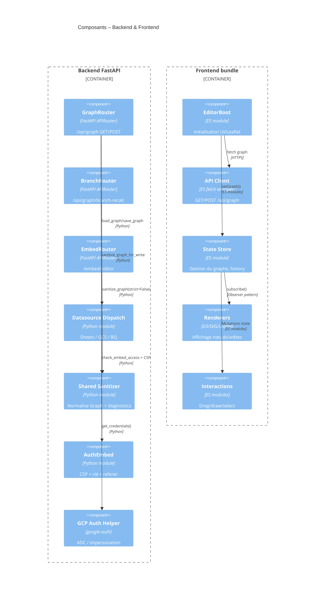

# Diagramme C4 – Composants principaux

```mermaid
C4Component
    title Composants – Backend & Frontend
    Container_Boundary(api, "Backend FastAPI"){
        Component(routerGraph, "GraphRouter", "FastAPI APIRouter", "/api/graph GET/POST")
        Component(routerBranch, "BranchRouter", "FastAPI APIRouter", "/api/graph/branch-recalc")
        Component(routerEmbed, "EmbedRouter", "FastAPI APIRouter", "/embed/editor")
        Component(datasource, "Datasource Dispatch", "Python module", "Sheets / GCS / BQ")
        Component(sharedSanitizer, "Shared Sanitizer", "Python module", "Normalise Graph + diagnostics")
        Component(authEmbed, "AuthEmbed", "Python module", "CSP + clé + referer")
        Component(gcpAuth, "GCP Auth Helper", "google-auth", "ADC / impersonation")
    }
    Container_Boundary(front, "Frontend bundle"){
        Component(editorBoot, "EditorBoot", "ES module", "Initialisation UI/Leaflet")
        Component(apiClient, "API Client", "ES fetch wrapper", "GET/POST /api/graph")
        Component(stateStore, "State Store", "ES module", "Gestion du graphe, history")
        Component(renderers, "Renderers", "D3/SVG/Leaflet", "Affichage nœuds/arêtes")
        Component(interactions, "Interactions", "ES modules", "Drag/draw/select")
    }

    Rel(routerGraph, datasource, "load_graph/save_graph", "Python")
    Rel(routerGraph, sharedSanitizer, "sanitize_graph_for_write", "Python")
    Rel(routerBranch, sharedSanitizer, "sanitize_graph(strict=False)", "Python")
    Rel(routerEmbed, authEmbed, "check_embed_access + CSP", "Python")
    Rel(datasource, gcpAuth, "get_credentials()", "Python")
    Rel(editorBoot, apiClient, "fetch graph", "HTTPS")
    Rel(editorBoot, stateStore, "setGraph()", "ES modules")
    Rel(stateStore, renderers, "subscribe()", "Observer pattern")
    Rel(stateStore, interactions, "Mutations state", "ES modules")
```
