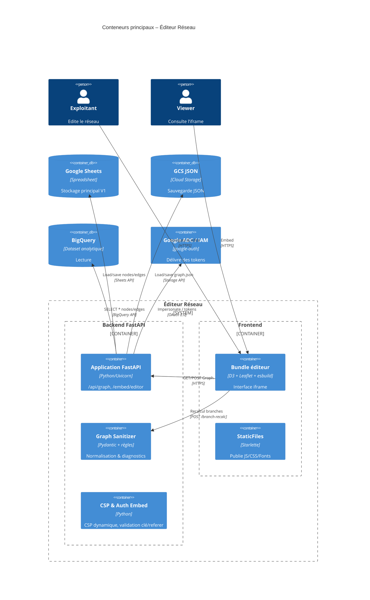

# Diagramme C4 – Conteneurs

```mermaid
C4Container
    title Conteneurs principaux – Éditeur Réseau
    Person(exploitant, "Exploitant", "Edite le réseau")
    Person(viewer, "Viewer", "Consulte l’iframe")
    System_Boundary(er, "Éditeur Réseau"){
        Container_Boundary(api_boundary, "Backend FastAPI"){
            Container(api, "Application FastAPI", "Python/Uvicorn", "/api/graph, /embed/editor")
            Container(sanitizer, "Graph Sanitizer", "Pydantic + règles", "Normalisation & diagnostics")
            Container(auth, "CSP & Auth Embed", "Python", "CSP dynamique, validation clé/referer")
        }
        Container_Boundary(front_boundary, "Frontend"){
            Container(front, "Bundle éditeur", "D3 + Leaflet + esbuild", "Interface iframe")
            Container(static, "StaticFiles", "Starlette", "Publie JS/CSS/Fonts")
        }
    }
    ContainerDb(sheet, "Google Sheets", "Spreadsheet", "Stockage principal V1")
    ContainerDb(json, "GCS JSON", "Cloud Storage", "Sauvegarde JSON")
    ContainerDb(bq, "BigQuery", "Dataset analytique", "Lecture")
    Container(gauth, "Google ADC / IAM", "google-auth", "Délivre des tokens")

    Rel(exploitant, front, "Navigate & édite", "HTTPS")
    Rel(front, api, "GET/POST Graph", "HTTPS")
    Rel(front, sanitizer, "Recalcul branches", "POST /branch-recalc")
    Rel(api, sheet, "Load/save nodes/edges", "Sheets API")
    Rel(api, json, "Load/save graph.json", "Storage API")
    Rel(api, bq, "SELECT * nodes/edges", "BigQuery API")
    Rel(api, gauth, "Impersonate / tokens", "OAuth 2.0")
    Rel(viewer, front, "Embed", "HTTPS")
```
