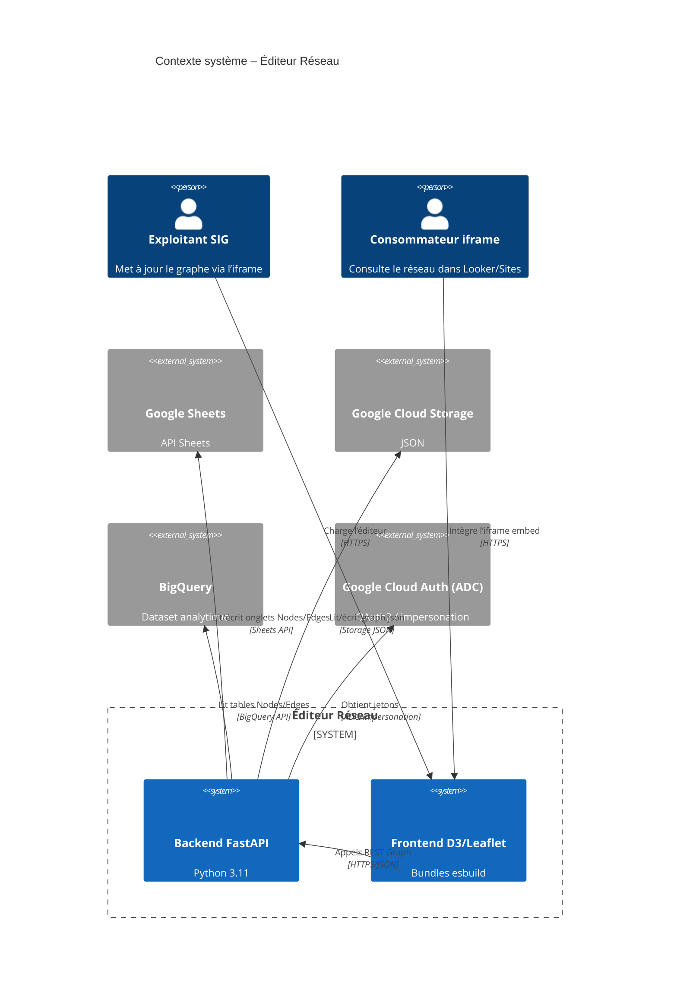

# Diagramme C4 – Contexte

```mermaid
C4Context
    title Contexte système – Éditeur Réseau
    Person(exploitant, "Exploitant SIG", "Met à jour le graphe via l’iframe")
    Person(viewer, "Consommateur iframe", "Consulte le réseau dans Looker/Sites")
    System_Boundary(er, "Éditeur Réseau"){
        System(api, "Backend FastAPI", "Python 3.11", "Expose /api/graph, /embed/editor")
        System(front, "Frontend D3/Leaflet", "Bundles esbuild", "Éditeur interactif")
    }
    System_Ext(sheets, "Google Sheets", "API Sheets", "Stockage V1")
    System_Ext(gcs, "Google Cloud Storage", "JSON", "Export/import")
    System_Ext(bq, "BigQuery", "Dataset analytique", "Lecture uniquement")
    System_Ext(gauth, "Google Cloud Auth (ADC)", "OAuth2 / impersonation", "Fournit des credentials")

    Rel(exploitant, front, "Charge l’éditeur", "HTTPS")
    Rel(front, api, "Appels REST Graph", "HTTPS/JSON")
    Rel(api, sheets, "Lit/écrit onglets Nodes/Edges", "Sheets API")
    Rel(api, gcs, "Lit/écrit graph.json", "Storage JSON")
    Rel(api, bq, "Lit tables Nodes/Edges", "BigQuery API")
    Rel(api, gauth, "Obtient jetons", "ADC/Impersonation")
    Rel(viewer, front, "Intègre l’iframe embed", "HTTPS")
```
