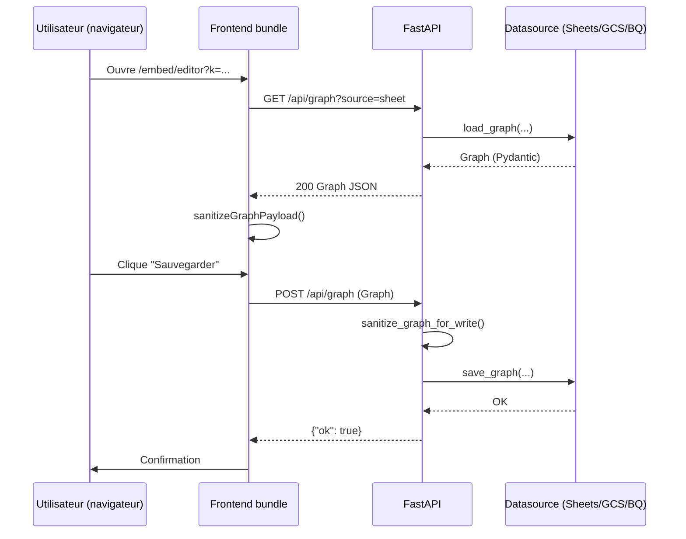
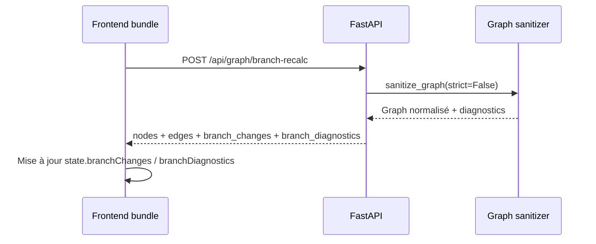

# Séquences critiques

## Chargement et sauvegarde d’un graphe

```mermaid
sequenceDiagram
    participant U as Utilisateur (navigateur)
    participant FE as Frontend bundle
    participant API as FastAPI
    participant DS as Datasource (Sheets/GCS/BQ)

    U->>FE: Ouvre /embed/editor?k=...
    FE->>API: GET /api/graph?source=sheet
    API->>DS: load_graph(...)
    DS-->>API: Graph (Pydantic)
    API-->>FE: 200 Graph JSON
    FE->>FE: sanitizeGraphPayload()
    U->>FE: Clique "Sauvegarder"
    FE->>API: POST /api/graph (Graph)
    API->>API: sanitize_graph_for_write()
    API->>DS: save_graph(...)
    DS-->>API: OK
    API-->>FE: {"ok": true}
    FE->>U: Confirmation
```

## Recalcul de branches

```mermaid
sequenceDiagram
    participant FE as Frontend bundle
    participant API as FastAPI
    participant SAN as Graph sanitizer

    FE->>API: POST /api/graph/branch-recalc
    API->>SAN: sanitize_graph(strict=False)
    SAN-->>API: Graph normalisé + diagnostics
    API-->>FE: nodes + edges + branch_changes + branch_diagnostics
    FE->>FE: Mise à jour state.branchChanges / branchDiagnostics
```
