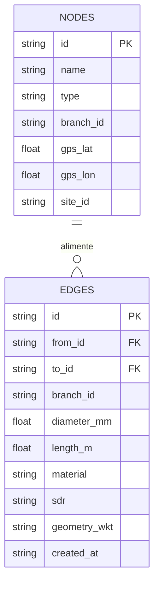

# Référence base de données & sources de vérité

## Vue d’ensemble
- **Source primaire** : Google Sheets (onglets `Nodes` et `Edges`).
- **Sauvegarde JSON** : Google Cloud Storage (`gs://.../graph.json`) ou fichier local.
- **Lecture analytique** : tables BigQuery (lecture seule).

## Google Sheets
| Onglet | Colonnes recommandées | Commentaires |
| --- | --- | --- |
| `Nodes` | `id`, `name/nom`, `type`, `branch_id/id_branche`, `gps_lat`, `gps_lon`, `x`, `y`, `site_id`, `diameter_mm`, `material`, `pm_offset_m`, `collector_well_ids` | Harmonisation FR/EN via `app/sheets.py`, `app/datasources/sheets.py`. |
| `Edges` | `id`, `from_id/source_id`, `to_id/cible_id`, `branch_id/id_branche`, `diameter_mm/diametre_mm`, `length_m/longueur_m`, `material`, `sdr`, `geometry`, `created_at/date_creation`, `commentaire` | `geometry` doit fournir au moins deux points; `created_at` ISO-8601 requis. |

## BigQuery (lecture)
| Table | Colonnes clés | Notes |
| --- | --- | --- |
| `{dataset}.nodes` | `id`, `name/nom`, `type`, `branch_id/id_branche`, `site_id`, `gps_lat`, `gps_lon`, `diameter_mm/diametre_mm`, `material` | Colonnes multi-valeurs acceptent ARRAY ou chaîne `;`. |
| `{dataset}.edges` | `id`, `from_id/source_id`, `to_id/cible_id`, `branch_id/id_branche`, `diameter_mm/diametre_mm`, `length_m/longueur_m`, `material`, `sdr`, `geometry_wkt/geometry`, `created_at/date_creation`, `active/actif` | `geometry_wkt` doit être une `LINESTRING`. Longueur recalculée si absente. |

### Diagramme ER

## GCS JSON
- URI : `gs://bucket/path/graph.json` ou `file:///abs/path`.
- Structure : `reference/schemas/graph.schema.json`.
- Lors de la sauvegarde, les coordonnées `x/y` existantes sont conservées si présentes.

## Sauvegarde & restauration
- Export régulier via `curl -X POST ... gcs_uri=gs://...`.
- ⚠️ TODO : script de restauration vers Sheets si besoin.
